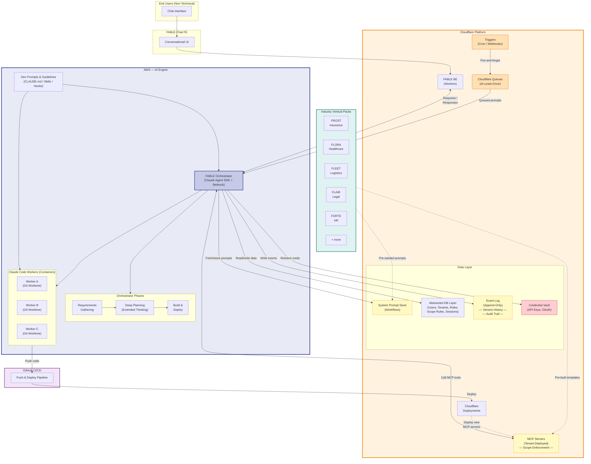

# FABLE Brainstorm

## Company & Product

**Company**: ForwardFlow

**Core Platform**: **FABLE** — Forwardflow AI Business Logic Engine

A self-programming, industry-agnostic, chat-driven AI platform for business automation. Non-technical end users describe what they need in plain language, and FABLE builds, deploys, and operates the integrations and workflows autonomously.

The system literally grows its own capabilities on demand — FABLE builds MCP servers that FABLE itself then uses.

---

## Industry Vertical Packs

FABLE is the engine. Each vertical gets a branded capability pack with pre-seeded workflows, MCP integrations, industry-specific system prompts, and domain vocabulary.

| Pack      | Full Name                                                    | Industry      | Example Pre-Seeded Capabilities                                                                     |
| --------- | ------------------------------------------------------------ | ------------- | --------------------------------------------------------------------------------------------------- |
| **FROST** | Forwardflow Risk Optimization & Scoring Technology           | Insurance     | Risk scoring models, claims processing workflows, underwriting automation, carrier API integrations |
| **FLORA** | Forwardflow Logic for Operational Resource Allocation        | Healthcare    | Patient scheduling, EHR integrations (Epic, Cerner), HIPAA-compliant workflows, resource allocation |
| **FLEET** | Forwardflow Logistics & Efficiency Enhancement Tool          | Logistics     | Route optimization, shipment tracking APIs, warehouse management, carrier integrations              |
| **FLAIR** | Forwardflow Legal AI Intelligence & Research                 | Legal         | Case research workflows, document review, court filing integrations, billing/time tracking          |
| **FORTE** | Forwardflow Optimization for Recruitment & Talent Engagement | HR            | ATS integrations (Greenhouse, Lever), candidate pipeline automation, onboarding workflows           |
| **FORGE** | Forwardflow Operations & Resource Guidance Engine            | Manufacturing | Supply chain integrations, production scheduling, quality control workflows, ERP connectors         |
| **FLUX**  | Forwardflow Logic for Utility eXcellence                     | Energy        | Grid monitoring integrations, usage analytics, regulatory compliance workflows, meter data systems  |
| **FRESH** | Forwardflow Retail & E-commerce Sales Hub                    | Retail        | Shopify/WooCommerce integrations, inventory sync, marketing automation, POS connectors              |
| **FRAME** | Forwardflow Resource Allocation & Management Engine          | Construction  | Project management integrations (Procore), bid tracking, resource scheduling, permit workflows      |

### How Vertical Packs Work

Each pack is essentially a **Tier 2 Industry Prompt** (see prompt architecture below) plus a bundle of:

1. **Pre-built MCP server templates** — Common integrations for that industry (e.g., FROST ships with carrier API templates, FLORA ships with EHR connectors)
2. **Pre-seeded workflow templates** — Common automations (e.g., FORTE ships with "new applicant screening" and "interview scheduling" workflows)
3. **Industry system prompt** — Domain vocabulary, compliance requirements, common business logic patterns
4. **Onboarding flow** — Guided setup that asks the right questions for that industry ("Which EHR system do you use?" for FLORA, "Which carriers do you work with?" for FROST)

### Deployment Model

```
FABLE (core engine)
  +-- FROST pack installed    --> Insurance company tenant
  +-- FLORA pack installed    --> Healthcare org tenant
  +-- FORTE pack installed    --> Staffing agency tenant
  +-- No pack (vanilla FABLE) --> Custom/general use tenant
```

A tenant can also have **multiple packs** if their business spans industries (e.g., a healthcare staffing company might use FLORA + FORTE).

Packs are additive — they extend FABLE's capabilities, they don't replace anything. A FROST tenant can still do everything vanilla FABLE can do, plus insurance-specific capabilities.

---

## High Level Architecture

```
End User (non-technical)
    |
    |  "I want to send marketing emails to my CRM contacts every Friday"
    |
    v
+------------------------------------------------------+
|  FABLE Chat FE                                        |
|  (Conversational UI - guides, doesn't intimidate)     |
+----------------------+-------------------------------+
                       |
                       v
+------------------------------------------------------+
|  FABLE BE (Cloudflare Workers)                        |
|  Session mgmt, auth, routing, credential vault        |
+----------------------+-------------------------------+
                       |
                       v
+------------------------------------------------------+
|  FABLE Orchestrator (Agent SDK + Bedrock)             |
|                                                       |
|  +-------------+  +--------------+  +-------------+  |
|  | Requirements |->| Planning     |->| Build &     |  |
|  | Gathering    |  | (Extended    |  | Deploy      |  |
|  | (dialogue)   |  |  Thinking)   |  | (Workers)   |  |
|  +-------------+  +--------------+  +-------------+  |
+----------------------+-------------------------------+
                       |
                       v
+------------------------------------------------------+
|  FABLE's Growing Capability Layer                     |
|                                                       |
|  +---------+ +---------+ +---------+ +-----------+   |
|  |CRM MCP  | |Gmail MCP| |GDocs MCP| |Workflow   |   |
|  |Server   | |Server   | |Server   | |Engine     |   |
|  +---------+ +---------+ +---------+ +-----------+   |
|                                                       |
|  Each MCP server was BUILT BY FABLE on user request   |
+------------------------------------------------------+
```

### Mermaid Diagram



### Diagram Files

- **D2**: `architecture.d2` — source, editable. Rendered to `architecture.svg` and `architecture.png`
- **Mermaid**: Above (renders natively in GitHub markdown)
- **Excalidraw**: `architecture.excalidraw` — open in Excalidraw app or excalidraw.com

### Component Breakdown

- **FABLE Chat FE**: Conversational frontend for non-technical users
- **FABLE BE**: Backend on Cloudflare Workers — session management, auth, routing, credential vault
- **Orchestrator**: Claude Agent SDK running on AWS, using Bedrock Claude with extended thinking
- **Workers**: Claude Code instances (containers/VMs) that autonomously build code
- **MCP Servers**: Deployed to Cloudflare Workers — each one wraps a third-party API
- **System Prompt Store**: Tiered prompt system stored in Cloudflare D1/KV (workflows ARE stored prompts)
- **Abstracted DB Layer**: Cloudflare D1 — users, tenants, workflow logs, audit trails
- **Credential Vault**: Encrypted storage for API keys, OAuth tokens, per-tenant secrets

---

## Core Concept: The Self-Extending Loop

1. User says "connect my CRM"
2. FABLE builds an MCP server wrapping the CRM API
3. Deploys it to Cloudflare Workers
4. Registers it with the FABLE instance
5. Now FABLE has CRM access as a native tool
6. User says "send emails to my agents" — FABLE can now query the CRM it just connected

Every interaction potentially makes FABLE more capable for that tenant.

---

## Autonomous Development System

### Orchestrator (Claude Agent SDK on AWS)

Use the Claude Agent SDK — not raw Bedrock API. The Agent SDK provides the full Claude Code tool suite (Read, Write, Edit, Bash, Glob, Grep) plus hooks, sub-agents, MCP, and session management — all programmable. Natively supports Bedrock auth via `CLAUDE_CODE_USE_BEDROCK=1`. Node.js implementation.

```javascript
// Conceptual orchestrator skeleton (Node.js)
import { query } from '@anthropic-ai/claude-agent-sdk';

async function orchestrate(userRequest) {
  // Phase 1: Requirements gathering (conversational)
  const requirements = await query({
    prompt: REQUIREMENTS_PROMPT.replace('{request}', userRequest),
    options: {
      maxThinkingTokens: 16384,
      allowedTools: ['AskUserQuestion'],
    },
  });

  // Phase 2: Deep planning
  const plan = await query({
    prompt: PLANNING_PROMPT.replace('{requirements}', requirements),
    options: {
      maxThinkingTokens: 65536,
      jsonSchema: PLAN_SCHEMA,
    },
  });

  // Phase 3-6: Decompose, dispatch, gather, commit
  // ...
}
```

### Planning with Extended Thinking

Orchestrator produces a structured plan with high thinking budget (32K-65K tokens):

```json
{
  "plan": {
    "summary": "Add user authentication with JWT",
    "tasks": [
      {
        "id": "task-1",
        "title": "Create auth middleware",
        "module": "src/middleware/",
        "branch": "feat/auth-middleware",
        "dependencies": [],
        "interface_contracts": {
          "exports": ["authMiddleware", "AuthContext"],
          "types": "interface AuthContext { userId: string; role: Role; }"
        },
        "acceptance_criteria": [
          "Middleware validates JWT tokens",
          "Returns 401 for invalid/expired tokens",
          "Passes all tests"
        ],
        "claude_md_overrides": "Use jose library for JWT."
      }
    ]
  }
}
```

Key planning principles:

- **Spatial decomposition**: Each task targets a distinct module/directory to minimize merge conflicts
- **Interface contracts first**: Define types and exports before workers start
- **Dependency DAG**: Tasks declare dependencies for scheduling
- **Acceptance criteria as tests**: Every task gets testable success conditions

### Worker Execution

Each worker is a Claude Code instance running in its own **git worktree** with the **Ralph Wiggum** autonomous loop:

```bash
# Orchestrator sets up worker environment
git worktree add /work/task-1 -b feat/auth-middleware
cp /tmp/task-1-claude.md /work/task-1/CLAUDE.md

# Run worker with Ralph Wiggum loop
cd /work/task-1
claude -p "Implement the task described in CLAUDE.md. \
  Run tests after implementation. \
  When ALL acceptance criteria pass, output TASK_COMPLETE." \
  --dangerously-skip-permissions \
  --max-turns 50 \
  --output-format stream-json
```

**Git worktrees** for isolation:

- Each worker gets its own filesystem checkout on its own branch
- No file-level conflicts between parallel workers
- All share the same `.git` directory (efficient)

**Ralph Wiggum loop** for persistence:

- Write code -> run tests -> see failures -> fix -> repeat
- Stop hook catches Claude's exit and re-feeds the prompt
- `--max-turns` / `--max-iterations` caps prevent runaway costs
- Completion promise (`TASK_COMPLETE`) is the exit signal

**Container isolation** (production):

- ECS Fargate tasks with pre-baked Docker image (Claude Code + deps)
- No internet access (just Bedrock API endpoint)
- Ephemeral — destroyed after task completion

### Integration Phase

Once workers complete:

1. **Gather**: Pull each worker's branch
2. **Merge**: Create integration branch, merge worker branches sequentially
3. **Validate**: Run full test suite, typecheck, lint on merged code
4. **Fix**: If integration tests fail, spin up another Claude Code instance
5. **Commit & PR**: Push to GitHub, create PR, CI/CD deploys

---

## Nested CLAUDE.md Strategy

### Static Layers (committed to repo)

```
project/
|-- CLAUDE.md                          # L0: Project-wide
|-- .claude/
|   |-- settings.json                  # Permissions, hooks, MCP servers
|   |-- commands/
|   |   |-- plan.md                    # /plan slash command
|   |   |-- implement.md              # /implement slash command
|   |   +-- report-status.md          # /report-status slash command
|   +-- agents/
|       |-- worker.md                  # Worker sub-agent definition
|       |-- reviewer.md               # Code review sub-agent
|       +-- integrator.md             # Integration sub-agent
|-- src/
|   |-- CLAUDE.md                      # L1: Source conventions
|   |-- api/
|   |   +-- CLAUDE.md                  # L2: API patterns
|   |-- models/
|   |   +-- CLAUDE.md                  # L2: Model patterns
|   +-- middleware/
|       +-- CLAUDE.md                  # L2: Middleware patterns
+-- .claude/rules/
    |-- testing.md                     # Scoped rule: *.test.ts files
    |-- api-endpoints.md               # Scoped rule: src/api/**
    +-- security.md                    # Scoped rule: src/auth/**
```

**L0 — Project Root CLAUDE.md** (example):

```markdown
# FABLE Project

## Architecture

- TypeScript, Cloudflare Workers, Hono framework
- D1 for database, R2 for storage
- Monorepo with packages: api, chat-fe, shared

## Conventions

- Strict TypeScript, no `any`
- All functions must have return types
- Use zod for runtime validation at boundaries
- Error handling: Result<T, E> pattern, never throw

## Build & Test

- `npm run build` — builds all packages
- `npm run test` — runs vitest
- `npm run lint` — runs eslint + prettier check
```

### Dynamic Layer (orchestrator-generated per task)

Before dispatching a worker, the orchestrator writes a task-specific CLAUDE.md:

```markdown
# Task: Create auth middleware (task-1)

## Your Assignment

Implement JWT authentication middleware for the Hono API framework.

## Interface Contract (DO NOT deviate)

export function authMiddleware(): MiddlewareHandler;
export interface AuthContext {
userId: string;
role: 'admin' | 'user';
exp: number;
}

## Acceptance Criteria

- [ ] All tests pass: `npm run test -- src/middleware/auth`
- [ ] TypeScript compiles: `npm run typecheck`
- [ ] Lint passes: `npm run lint`

## Completion Signal

When ALL criteria pass, output: TASK_COMPLETE
```

---

## Hooks Architecture

```json
{
  "hooks": {
    "PreToolUse": [
      {
        "matcher": "Bash",
        "hooks": [
          {
            "type": "command",
            "command": "./scripts/validate-command.sh"
          }
        ]
      }
    ],
    "PostToolUse": [
      {
        "matcher": "Edit|Write",
        "hooks": [
          {
            "type": "command",
            "command": "./scripts/post-edit-lint.sh"
          }
        ]
      }
    ],
    "Stop": [
      {
        "hooks": [
          {
            "type": "command",
            "command": "./scripts/ralph-stop-hook.sh"
          }
        ]
      }
    ],
    "SubagentStop": [
      {
        "hooks": [
          {
            "type": "command",
            "command": "./scripts/report-worker-complete.sh"
          }
        ]
      }
    ]
  }
}
```

- **PreToolUse (Bash)**: Validates commands — blocks destructive operations, limits scope to worktree
- **PostToolUse (Edit|Write)**: Runs linter/formatter on changed files immediately
- **Stop**: Ralph Wiggum loop — re-feeds prompt unless completion promise detected
- **SubagentStop**: Reports worker completion status back to orchestrator

---

## MCP Server Factory

The heart of FABLE. Three tiers — prefer existing, adapt when needed, generate as last resort.

### Tier 1: Curated Catalog (fastest — seconds)

ForwardFlow maintains a vetted catalog of existing open-source MCP servers. Hundreds already exist on GitHub:

- **Anthropic official**: GitHub, GitLab, Slack, Google Drive, PostgreSQL, Puppeteer, etc.
- **Smithery registry**: Community-maintained catalog of MCP servers (smithery.ai)
- **npm/GitHub ecosystem**: @modelcontextprotocol/server-\*, community packages

The catalog is:

- **Vetted for security** — reviewed for credential handling, no data exfiltration, sandboxed
- **Tested for reliability** — integration tests, version pinned
- **Deployment-ready** — pre-configured for Cloudflare Workers or containerized deployment
- **Documented** — FABLE knows what tools each server exposes and how to configure it

When a user says "connect my HubSpot", FABLE checks the catalog first. If there's a vetted HubSpot MCP server, it deploys it immediately — just needs the user's API key.

```
fable-mcp-catalog/
|-- registry.json                    # Master list: name, source, version, status, tools
|-- vetted/
|   |-- hubspot/
|   |   |-- source: github.com/...   # Points to upstream repo
|   |   |-- config.json              # Deployment config, required env vars
|   |   |-- tools.json               # What tools this server exposes
|   |   +-- test/                    # Integration tests
|   |-- salesforce/
|   |-- gmail/
|   |-- slack/
|   |-- notion/
|   |-- google-sheets/
|   |-- stripe/
|   |-- twilio/
|   +-- ...                          # Target: top 50-100 SaaS integrations
```

### Tier 2: Runtime Discovery + Review (medium — minutes)

When the catalog doesn't have what's needed, FABLE searches the broader ecosystem:

1. **Search**: GitHub, Smithery, npm for existing MCP servers matching the request
2. **Evaluate**: FABLE reads the source code, checks for security issues, assesses quality
3. **Present to user**: "I found an open-source MCP server for [X]. It has 200 GitHub stars and looks well-maintained. I've reviewed the code and it handles credentials securely. Want me to deploy it?"
4. **Deploy with guardrails**: Sandboxed deployment, limited permissions, monitoring
5. **Graduate to catalog**: If it works well, ForwardFlow can vet and add it to the official catalog

This is the discovery flywheel — the catalog grows organically from real user requests.

### Tier 3: AI-Generated (slowest — minutes to hours)

For truly novel APIs where no MCP server exists anywhere:

1. **FABLE reads the API documentation** (user provides URL or docs)
2. **Orchestrator plans the MCP server** — tools to expose, auth patterns, error handling
3. **Workers build it autonomously** — using the \_base scaffold and API docs
4. **Test and deploy** — integration tests, sandboxed deployment
5. **Contribute back** — optionally open-source the generated server for the community

```
_base/
|-- CLAUDE.md                        # How to build an MCP server from scratch
|-- scaffold/
|   |-- src/server.ts                # Base MCP server structure
|   |-- src/tools.ts                 # Tool definition patterns
|   |-- wrangler.toml                # Cloudflare deployment template
|   +-- test/                        # Test harness template
+-- deploy.sh                        # Deployment script
```

### Resolution Priority

```
User: "Connect my [X]"
         |
         v
   Is [X] in the curated catalog?
   YES --> Deploy immediately (Tier 1, seconds)
   NO  --> Search GitHub/Smithery/npm for [X] MCP server
           FOUND --> Review, confirm with user, deploy (Tier 2, minutes)
           NOT FOUND --> Build from API docs (Tier 3, minutes-hours)
```

### What Gets Built vs. Configured

| User Request                     | What FABLE Does                                  | Tier                       |
| -------------------------------- | ------------------------------------------------ | -------------------------- |
| "Connect my HubSpot"             | Deploy vetted HubSpot MCP from catalog           | **Tier 1** (seconds)       |
| "Connect my Pipedrive CRM"       | Find community MCP server, review, deploy        | **Tier 2** (minutes)       |
| "Connect my custom internal API" | Build new MCP server from API docs               | **Tier 3** (minutes-hours) |
| "Email agents every Friday"      | Deploy vetted Gmail MCP + create workflow prompt | **Tier 1** + config        |
| "Notify Slack on deal close"     | Deploy vetted Slack MCP + create event workflow  | **Tier 1** + config        |

The catalog grows over time. Every Tier 2 discovery and Tier 3 generation is a candidate to become a Tier 1 vetted entry. The system gets faster the more it's used.

---

## Three-Tier System Prompt Architecture

```
+-------------------------------------+
| Tier 1: FABLE Platform Prompt       |  <-- Same for all deployments
+-----------+-------------------------+
| Tier 2: Industry Prompt             |  <-- Real estate, healthcare, etc.
+-----------+-------------------------+
| Tier 3: Tenant Prompt               |  <-- "Acme Lending" specific
+-----------+-------------------------+
| Tier 4: Conversation Context        |  <-- Current session + history
+-----------+-------------------------+
| Available MCP Servers (dynamic)     |  <-- What FABLE has built so far
+-------------------------------------+
```

**Tier 1 — Platform (universal):**

- How FABLE converses with non-technical users
- Security protocols (credential handling, data access)
- How to break down requests into buildable steps
- How to explain technical concepts simply

**Tier 2 — Industry (per deployment):**

- Industry vocabulary and concepts
- Common workflows in that industry
- Regulatory/compliance requirements
- Typical integration targets

**Tier 3 — Tenant (per customer):**

- Their specific tools and systems
- Their business rules
- Their tone/brand voice for outbound communications
- Accumulated context from past interactions

These are composed system prompts stored in the System Prompt Store (Cloudflare D1/KV), not files on disk.

---

## User Conversation Flow (Example)

### "I want to integrate my CRM data"

```
FABLE:  Sure! Which CRM system do you use?
        [ Salesforce ]  [ HubSpot ]  [ Zoho ]  [ Other ]

User:   HubSpot

FABLE:  Got it — HubSpot. I'll need a few things to connect:

        1. Your HubSpot API key (I'll show you exactly where to find it)
        2. Which data you want access to (contacts, deals, both?)

        Let's start with the API key. Here's how to find it:
        -> Go to HubSpot Settings -> Integrations -> API Key
        -> Copy the key and paste it here

        Your key is encrypted and stored securely.

User:   [pastes key]

FABLE:  Connected! I can see your HubSpot account has:
        - 2,340 contacts
        - 156 deals
        - 12 custom properties

        What would you like to do with this data?
```

Behind the scenes:

1. Orchestrator identified "HubSpot CRM integration"
2. Checked for pre-built HubSpot MCP template (found it)
3. Configured template with user's API key, deployed to Cloudflare
4. Registered MCP server with this tenant's FABLE instance
5. Ran connectivity test and pulled summary data

---

## Workflow Execution: AI-Driven vs. Traditional

### The Key Insight

If FABLE's orchestrator is already an AI agent that can call MCP tools, then a "workflow" doesn't need to be a static cron job executing a rigid step sequence. It can just be a **stored system prompt** that the orchestrator runs when triggered. The System Prompt Store from the original architecture diagram IS the workflow definition layer — each stored prompt IS a workflow.

### Traditional Workflow Engine (rigid)

```
Cron fires Friday 9am
  -> Step 1: Call HubSpot MCP -> query contacts
  -> Step 2: Call template MCP -> render email
  -> Step 3: Call Gmail MCP -> send batch
  -> If step 2 fails: retry once, then notify user
```

Pre-defined steps. Breaks if anything unexpected happens. No judgment.

### AI-Driven Workflow (stored system prompt)

```
Cron fires Friday 9am -> triggers FABLE with stored prompt:

"Send this week's marketing email to active real estate agents
in CA and TX from our HubSpot CRM. Use the weekly market update
template. If any contacts have bounced emails, skip them and
flag them for review."
```

FABLE figures out the steps dynamically, handles edge cases, adapts if the data looks unexpected, and can improvise — "I noticed 30 contacts have no email address, I'll flag those for the user."

### What Traditional Infrastructure Is Still Needed For

| Need                        | Why AI Alone Isn't Enough                                                                                                                                              |
| --------------------------- | ---------------------------------------------------------------------------------------------------------------------------------------------------------------------- |
| **Trigger/scheduler**       | Something has to wake FABLE up at 9am Friday. A cron trigger, webhook listener, or event bus is still needed — it just fires a prompt instead of executing code steps. |
| **Credential storage**      | API keys and OAuth tokens need secure persistent storage outside AI context.                                                                                           |
| **MCP server hosting**      | The MCP servers themselves (HubSpot wrapper, Gmail wrapper) still need to run somewhere. Cloudflare Workers is a good fit for this.                                    |
| **State/history**           | Workflow run logs, audit trails, what was sent to whom — needs a database.                                                                                             |
| **Cost/latency guardrails** | Not every workflow justifies spinning up Claude. A simple "send a Slack message" is cheaper as a direct API call.                                                      |

### AI-First Execution Model

**Everything is a prompt. Everything runs through FABLE. There is no separate workflow engine.**

The architecture is radically simple:

```
Trigger (cron / webhook / event / user chat)
    |
    v
FABLE Orchestrator (always)
    |
    v
MCP Servers (tools FABLE calls as needed)
```

- No workflow engine that bypasses the AI
- The System Prompt Store IS the workflow store
- Triggers just invoke FABLE with a stored prompt
- If the task is simple ("send a Slack message"), Claude does it in one tool call — still fast
- If the task is complex, Claude reasons through it
- Model selection handles cost: Haiku for simple triggers, Sonnet for medium, Opus for complex reasoning

### Stored Prompt as Workflow Definition

```json
{
  "id": "wf_friday_marketing",
  "tenant_id": "tenant_acme_lending",
  "name": "Friday Agent Marketing Email",
  "trigger": {
    "type": "cron",
    "schedule": "0 9 * * 5",
    "timezone": "America/Los_Angeles"
  },
  "model": "sonnet",
  "system_prompt": "You are executing a scheduled workflow for Acme Lending. Your available tools include their HubSpot CRM and Gmail integrations.",
  "prompt": "Send this week's marketing email to active real estate agents in CA and TX from our HubSpot CRM. Use the weekly market update template. If any contacts have bounced emails, skip them and log them. If fewer than 10 contacts match, alert the user instead of sending — the filter may be wrong. After sending, report a summary of how many emails were sent, skipped, and any issues encountered.",
  "mcp_servers": ["hubspot", "gmail", "fable-templates"],
  "max_turns": 20,
  "on_failure": { "notify": "user" },
  "audit_log": true
}
```

The `prompt` field is the entire workflow. FABLE reads it, reasons about it, calls the MCP tools it needs, handles edge cases, and reports back. No rigid step definitions — just intent.

### Why This Is Powerful

1. **Non-technical users can modify workflows in plain English** — "Actually, also include agents in Nevada" is a prompt edit, not a code change
2. **FABLE handles edge cases automatically** — bounced emails, missing data, unexpected API responses
3. **Workflows can be conversational** — "Send the email, but first show me a preview" becomes natural
4. **New capabilities are immediately available** — when FABLE builds a new MCP server, all existing workflows can use it
5. **The system prompt store becomes a workflow library** — tenants accumulate a library of reusable prompts

### Cost Management via Model Selection

Every workflow is AI-driven, but not every workflow needs Opus. The stored prompt metadata controls which model runs it:

| Scenario                                         | Model  | Why                                                      |
| ------------------------------------------------ | ------ | -------------------------------------------------------- |
| Slack notification on event                      | Haiku  | One tool call, no reasoning needed                       |
| Daily data sync between systems                  | Haiku  | Straightforward multi-tool sequence                      |
| Weekly summary email                             | Sonnet | Needs summarization and composition                      |
| Marketing campaign to filtered contacts          | Sonnet | Judgment on filtering, personalization                   |
| Application review and scoring                   | Opus   | Complex reasoning, multiple data sources, risk decisions |
| "Do what you did last Friday but for Nevada too" | Sonnet | Natural language modification of existing workflow       |

This keeps the architecture unified (everything flows through FABLE) while managing cost pragmatically. The AI-first principle is: **the AI is always in the loop, but the size of the AI matches the complexity of the task.**

---

## Trigger Architecture

All triggers live on Cloudflare. Triggers are dumb — they just wake up the AI with a stored prompt. No logic, no branching, no retries in the trigger itself. The AI handles all of that.

### Principle

```
Triggers are thin. The AI is fat.
```

Cloudflare handles when things fire. AWS handles what happens when they do.

### Three Trigger Types

**1. Scheduled (Cron)**
Cloudflare Cron Triggers — built into Workers, zero additional infrastructure, free.

```
Cloudflare Cron ("0 9 * * 5")
    |
    v
Trigger Worker (thin)
    1. Look up workflow prompt from D1 by workflow_id
    2. Inject context: { trigger: "cron", timestamp, tenant_id }
    3. Enqueue to Cloudflare Queue
    |
    v
Consumer Worker
    1. Dequeue message
    2. Send prompt + context to AWS Orchestrator
    |
    v
FABLE Orchestrator (AWS)
    1. Runs the stored prompt (full AI reasoning)
    2. Calls MCP tools as needed
    3. Writes results to D1
    4. Notifies user if configured
```

**2. Webhooks (External Events)**
Worker HTTP endpoint — receives payloads from third-party services (HubSpot deal closed, Stripe payment received, GitHub PR merged, etc.)

```
External Service (e.g., HubSpot)
    |
    | POST https://api.fable.app/hooks/{tenant_id}/{workflow_id}
    |
    v
Webhook Worker (thin)
    1. Validate webhook signature (per-service auth)
    2. Look up workflow prompt from D1
    3. Inject context: { trigger: "webhook", payload: { ...event data }, tenant_id }
    4. Enqueue to Cloudflare Queue
    |
    v
(Same Consumer Worker -> AWS Orchestrator flow)
```

Webhook URLs are tenant-scoped and workflow-scoped. Each workflow that needs external events gets its own endpoint. FABLE generates these URLs when creating the workflow and provides them to the user:

```
FABLE: I've set up a webhook for when deals close in HubSpot.
       Add this URL to your HubSpot webhook settings:
       https://api.fable.app/hooks/acme-lending/wf_deal_close_notify

       I can walk you through where to find that in HubSpot if you'd like.
```

**3. User-Initiated (Chat)**
Already handled by the existing FABLE Chat FE -> BE -> Orchestrator flow. No additional trigger infrastructure needed.

### Cloudflare Queues as the Bridge

Cloudflare Queues sits between triggers and the orchestrator for reliability:

```
Trigger (cron/webhook/chat)
    |
    v
Cloudflare Queue
    |
    Provides:
    - At-least-once delivery (no lost triggers)
    - Retries if AWS orchestrator is down
    - Dead-letter queue for persistent failures
    - Backpressure if too many triggers fire at once
    - Audit trail of every trigger that fired
    |
    v
Consumer Worker -> AWS Orchestrator
```

### Why Not AWS EventBridge / Step Functions

- **EventBridge**: Adds a service that does less than Cloudflare Cron Triggers already do. Cloudflare cron is free and already in the stack.
- **Step Functions**: A workflow engine — but the AI IS the workflow engine. Adding Step Functions would create a second execution path that bypasses the AI-first principle.
- **SQS**: Could buffer between trigger and orchestrator, but Cloudflare Queues does the same thing and keeps everything on one platform.
- **Lambda**: Would need AWS infrastructure for triggers that currently live naturally on Cloudflare. Adds cross-cloud complexity for no benefit.

### Async Pattern

Cloudflare Workers have a ~30-second CPU time limit. The trigger Worker can't wait for the orchestrator to finish (which could take minutes or hours). The pattern is always fire-and-forget:

1. Trigger Worker fires, enqueues the prompt, returns immediately
2. Orchestrator runs on AWS for however long it needs
3. Orchestrator writes results back to Cloudflare D1
4. Orchestrator sends notifications (email, Slack, chat message, etc.)

---

## Industry Packs Evolution

### How Packs Come Into Existence

**Phase 1 — Curated (now)**
ForwardFlow builds and maintains official packs. Each pack is a first-party product:

- Research the industry (workflows, tools, compliance, vocabulary)
- Identify the top 10-20 integrations for that vertical
- Pre-build MCP server catalog entries for those integrations
- Write the industry system prompt (Tier 2)
- Create onboarding flow templates
- Ship as part of the FABLE product

ForwardFlow controls quality, security, and positioning. Packs are a differentiator and a sales tool — "FABLE with FROST" is a product for insurance companies.

**Phase 2 — Learned (ongoing)**
Usage patterns across tenants inform the roadmap:

- If 10 insurance tenants all connect the same niche carrier API, that's a signal to add it to FROST's catalog
- If healthcare tenants keep building similar patient scheduling workflows, that becomes a FLORA template
- Analytics dashboard tracks: most-requested integrations, most-created workflow patterns, common user journeys per industry
- The data tells ForwardFlow where to invest — which packs to build next, which existing packs to expand

This creates a flywheel: more tenants → more usage data → better packs → more tenants.

**Phase 3 — Marketplace (future)**
Third-party developers, consultants, and industry experts can build and sell plugins:

- Revenue share model (ForwardFlow takes a cut)
- Gated behind a review/approval process:
  - Security audit (credential handling, data access, no exfiltration)
  - Quality review (reliability, error handling, documentation)
  - Compliance check (industry-specific regulatory requirements)
- Types of marketplace offerings:
  - Individual MCP server integrations (niche tools)
  - Workflow templates (pre-built automation patterns)
  - Full industry packs (new verticals ForwardFlow hasn't built yet)
  - Custom skills/plugins for specific use cases

Marketplace is later-stage. Prerequisites:

- Stable core platform
- At least 2-3 strong curated packs proving the model
- Developer documentation and SDK for pack creation
- Review/approval pipeline (its own product surface)
- Billing and revenue share infrastructure

### Pack Lifecycle

```
Industry signal (market research / customer request / usage data)
    |
    v
ForwardFlow builds curated pack
    |
    v
Pack ships with FABLE as a product feature
    |
    v
Tenant usage generates data
    |
    v
Data informs pack expansion (new integrations, workflow templates)
    |
    v
Eventually: marketplace contributors add niche extensions
```

---

## Autonomy Model

Hard boundary between two categories of decisions. FABLE must never burden a non-technical user with technical questions, and must never make business decisions without the user.

### Technical Decisions — Fully Autonomous

FABLE decides these without asking. Guided entirely by Development Prompts & Guidelines (CLAUDE.md, skills, hooks, industry pack prompts).

Examples the user **never** sees:

- Which MCP server to use or build
- Database schema design
- API patterns (REST vs GraphQL, pagination strategy)
- Code architecture (file structure, naming, patterns)
- Deployment configuration (Workers, cron schedules, queue settings)
- Error handling and retry logic
- Which model to use for a workflow (Haiku/Sonnet/Opus)
- Git branching, CI/CD pipeline details

The Development Prompts & Guidelines layer is what makes this possible. Every technical decision that would normally require a developer is pre-encoded in:

- Project-level CLAUDE.md (architecture, conventions, tech stack)
- Industry pack prompts (compliance requirements, domain patterns)
- Tenant-level accumulated context (what's already been built, how things connect)

### Business Decisions — Always Ask the User

FABLE asks these in plain, non-technical language. These are decisions only the user can make.

Examples FABLE **always** asks:

- "Who should be able to see this dashboard — everyone, or just managers?"
- "Should this email go to all agents, or only active ones in CA and TX?"
- "What happens when a deal is under $50,000 — include it in the report or skip it?"
- "Should this workflow run every Friday, or just the first Friday of the month?"
- "When a new application comes in, should I flag it for review or process it automatically?"

### The AI's Job

Know which category a decision falls into. The system prompt (Tier 1 — Platform) encodes this boundary explicitly:

```
When building or modifying a workflow:
- NEVER ask the user about technical implementation details
  (code, architecture, deployment, infrastructure)
- ALWAYS ask the user about business logic, access control,
  data scoping, and user-facing behavior
- If unsure whether a decision is technical or business,
  default to asking — but phrase it in business terms,
  never technical terms
```

### Gray Areas

Some decisions straddle the boundary. FABLE handles these by translating:

| Actual Decision                              | What the User Sees                                                                   |
| -------------------------------------------- | ------------------------------------------------------------------------------------ |
| Database access control (row-level security) | "Who should be able to see this data?"                                               |
| API rate limiting strategy                   | "How often should this check for updates — every minute, every hour, or once a day?" |
| Data retention policy                        | "How long should I keep the history — 30 days, 90 days, or forever?"                 |
| Webhook vs polling for integration           | (Never asked — FABLE picks the best approach)                                        |
| Encryption at rest                           | (Never asked — always encrypted, non-negotiable)                                     |

### Confirmation, Not Approval

For build actions, FABLE gives a **simple confirmation**, not a technical plan:

```
FABLE:  I'll set up your Gmail connection now so you can
        send emails to your agents. This takes about a minute.

        [ Go ahead ]    [ Not right now ]
```

NOT:

```
FABLE:  I'm going to deploy a Gmail MCP server to Cloudflare
        Workers using OAuth 2.0 with PKCE, store the refresh
        token in encrypted KV storage, and register it with
        your tenant's MCP registry. The server will expose
        send_email and list_drafts tools. Shall I proceed?
```

The first is a business confirmation. The second is a technical plan. Non-technical users see the first. Always.

---

## OAuth Architecture

OAuth is infrastructure, not intelligence. It lives entirely on Cloudflare. The AI never touches tokens — it just sees whether an integration is connected or not.

### The User Experience

```
User:   "I want to send emails through my Gmail"

FABLE:  To send emails on your behalf, I'll need access to your
        Gmail account. This is a secure connection — I'll only
        request permission to send emails, nothing else.

        [ Authorize Gmail → ]    (button in chat)

User:   (clicks button → popup opens → Google consent → Allow → popup closes)

FABLE:  Gmail connected! I can see your account is simon@acmelending.com.
        You can disconnect this anytime by saying "disconnect Gmail."
```

### The Flow

```
Chat FE                          Cloudflare BE                     Provider
   |                                  |                               |
   |  1. User clicks "Authorize"      |                               |
   |  ----opens popup/tab-----------> |                               |
   |                                  |  2. /oauth/start/{provider}   |
   |                                  |     Generate auth URL with:   |
   |                                  |     - client_id (ForwardFlow) |
   |                                  |     - scopes (minimal)        |
   |                                  |     - state (tenant + context)|
   |                                  |     - PKCE code_challenge     |
   |                                  |  --------redirect-----------> |
   |                                  |                               |
   |                                  |                 User consents |
   |                                  |                               |
   |                                  |  3. /oauth/callback/{provider}|
   |                                  |  <---code + state------------ |
   |                                  |                               |
   |                                  |  4. Exchange code for tokens  |
   |                                  |  --------POST /token--------> |
   |                                  |  <---access + refresh token-- |
   |                                  |                               |
   |                                  |  5. Store tokens in vault     |
   |                                  |     (encrypted, tenant-scoped)|
   |                                  |                               |
   |  6. Popup closes, chat updates   |                               |
   |  <---postMessage("connected")--- |                               |
```

### Key Decisions

**ForwardFlow registers as the OAuth app** with each provider — one client_id/secret per provider, platform-wide. Not per tenant. This is the standard SaaS pattern (same as Zapier, Make, etc.)

**Minimum scopes.** Only request what's needed. If user wants to send emails, request `gmail.send`. If they later need to read emails too, FABLE initiates incremental authorization to add `gmail.readonly`. No over-requesting upfront.

**The AI's view is simple.** The orchestrator doesn't know about OAuth mechanics. It sees:

```json
{
  "tenant": "acme-lending",
  "integrations": {
    "gmail": { "status": "connected", "account": "simon@acmelending.com" },
    "hubspot": { "status": "connected" },
    "slack": { "status": "needs_reauth" }
  }
}
```

If `connected`, the MCP server works. If `needs_reauth`, FABLE asks the user to reconnect. The AI never touches tokens directly.

### Token Refresh

Access tokens expire (typically 1 hour). A Cloudflare Cron Trigger handles this automatically:

```
Cloudflare Cron (every 30 min)
    |
    v
Token Refresh Worker
    1. Query vault for tokens expiring within 45 min
    2. For each: call provider's /token endpoint with refresh_token
    3. Store new access_token, update expiry
    4. If refresh fails: mark integration as "needs_reauth"
       → Next time user chats, FABLE says "Your Gmail connection
         expired, click here to reconnect"
```

### Provider Registry

ForwardFlow maintains OAuth config per provider (one-time setup):

```json
{
  "gmail": {
    "auth_url": "https://accounts.google.com/o/oauth2/v2/auth",
    "token_url": "https://oauth2.googleapis.com/token",
    "client_id": "forwardflow-client-id",
    "scopes": {
      "send": ["https://www.googleapis.com/auth/gmail.send"],
      "read": ["https://www.googleapis.com/auth/gmail.readonly"]
    },
    "refresh_supported": true
  },
  "salesforce": { ... },
  "hubspot": { ... }
}
```

The provider registry grows alongside the MCP server catalog — they're often 1:1.

### Security

- **PKCE** on all flows (prevents code interception)
- **State parameter** encodes tenant_id + context (prevents CSRF)
- **Server-side code exchange** (callback hits BE, not FE — secrets never exposed to browser)
- **Encrypted token storage** in Cloudflare KV or dedicated secrets store
- **Tenant isolation** — tenant A can never access tenant B's tokens
- **Revocation** — "disconnect Gmail" calls provider's revoke endpoint + deletes from vault
- **Incremental auth** — only escalate scopes when the user requests a capability that needs them

---

## Multi-Tenant Isolation

Each tenant gets:

```
Tenant: "Acme Lending"
|-- Credentials Vault (encrypted, Cloudflare KV or AWS Secrets Manager)
|   |-- hubspot_api_key: ****
|   |-- gmail_oauth_token: ****
|   +-- slack_webhook: ****
|-- MCP Server Registry (deployed servers for this tenant)
|   |-- hubspot -> acme-hubspot.fable-mcp.workers.dev
|   |-- gmail -> acme-gmail.fable-mcp.workers.dev
|   +-- slack -> acme-slack.fable-mcp.workers.dev
|-- Workflow Store (active automations)
|   |-- wf_friday_marketing
|   +-- wf_deal_close_notify
|-- System Prompt (Tier 3 - tenant-specific context)
|-- Conversation History
+-- Abstracted DB (D1 - users, contacts cache, workflow logs)
```

---

## Key Claude Code Capabilities Used

### CLAUDE.md Hierarchy

- Root: Project conventions, architecture, tech stack
- Nested per directory: Module-specific patterns
- `.claude/rules/`: Scoped rules with path frontmatter
- Dynamic per-task: Orchestrator-generated task instructions

### Hooks

- `PreToolUse`: Command validation, security guardrails
- `PostToolUse`: Auto-lint, formatting, quality checks
- `Stop`: Ralph Wiggum autonomous loop
- `SubagentStop`: Worker completion reporting

### Custom Slash Commands / Skills

- `/plan`: Generate implementation plan
- `/implement`: Begin task implementation
- `/report-status`: Generate progress report

### Custom Sub-Agents (.claude/agents/)

- `worker.md`: Task implementation agent
- `reviewer.md`: Code review agent
- `integrator.md`: Branch merging and conflict resolution agent

### MCP Integration

- GitHub MCP: Repo operations, PRs, issues
- fable-orchestrator MCP: Worker <-> orchestrator communication
- fable-state MCP: Plan and task state management
- Per-tenant MCP servers: CRM, email, docs, etc.

### Settings

- Granular permission policies (allow/deny)
- Hook configuration
- MCP server registration
- Tool restrictions per agent type

---

## Version History & Undo

### Principle: Event-Sourced State

Everything in FABLE is event-sourced. Don't just store current state — store every change as an immutable event. Current state is derived from the event log.

```
Event Log (append-only):
├── evt_001: workflow_created { id: "wf_friday_marketing", prompt: "...", by: "simon" }
├── evt_002: workflow_modified { id: "wf_friday_marketing", field: "prompt", old: "...CA, TX...", new: "...CA, TX, NV...", by: "simon" }
├── evt_003: integration_connected { service: "gmail", account: "simon@acme.com", by: "simon" }
├── evt_004: workflow_executed { id: "wf_friday_marketing", result: "sent 2,340 emails", trigger: "cron" }
├── evt_005: workflow_modified { id: "wf_friday_marketing", field: "schedule", old: "0 9 * * 5", new: "0 9 1-7 * 5", by: "simon" }
└── ...
```

This gives you:

- Undo to any point in time, not just "previous version"
- Full audit trail for free (every event IS the audit trail)
- Answer "what changed between Tuesday and Thursday?"
- Replay capability to rebuild state if needed
- Version diffs for any resource

### Undo Granularity

All expressed as natural language from a non-technical user:

| User Says                                      | What FABLE Does                                    |
| ---------------------------------------------- | -------------------------------------------------- |
| "Undo that"                                    | Revert the last change event                       |
| "Undo what we did last Tuesday"                | Revert all change events from that session         |
| "Revert the Friday email to how it was before" | Revert a specific resource to its previous version |
| "Undo everything from this session"            | Full session rollback                              |
| "Show me what changed this week"               | Query event log, present changes in plain language |

### Cascading Undo

Changes can have dependencies. FABLE never silently cascades — it asks:

```
User: "Disconnect my HubSpot"

FABLE: If I disconnect HubSpot, these will be affected:
       - Friday Marketing Email (uses HubSpot contacts)
       - Deal Close Notifications (uses HubSpot deals)

       Should I:
       [ Pause those workflows and disconnect ]
       [ Just disconnect — I'll fix the workflows later ]
       [ Never mind, keep it connected ]
```

This follows the autonomy model: disconnecting is a technical action (FABLE handles), but the business impact (workflows stop working) is a business decision (user decides).

### Reversible vs. Irreversible Actions

**Reversible** — FABLE can undo these directly:

| Action                                   | Undo Method                             |
| ---------------------------------------- | --------------------------------------- |
| Workflow prompt change                   | Revert to previous event version        |
| Configuration change (schedule, filters) | Revert to previous event version        |
| Integration connected                    | Disconnect, revoke tokens               |
| Workflow created                         | Delete (or archive)                     |
| MCP server deployed                      | Undeploy / rollback to previous version |

**Irreversible** — Once done, can't be taken back:

| Action                | Prevention                     | After the Fact                           |
| --------------------- | ------------------------------ | ---------------------------------------- |
| Emails sent           | Preview/confirm before sending | Log recipients, offer to pause workflow  |
| CRM records updated   | Preview changes before writing | Log what was changed, old vs. new values |
| Slack messages posted | Preview before posting         | Log what was sent and where              |
| External API calls    | Confirm side effects           | Log full request/response                |

For irreversible actions, FABLE's strategy is **prevention over reversal**:

```
FABLE: I'm about to send 2,340 marketing emails. Here's a sample:

       To: jane.smith@realty.com
       Subject: Weekly Market Update — Jan 28
       Preview: "Hi Jane, here are this week's top listings..."

       [ Send all 2,340 ]  [ Send me a test first ]  [ Cancel ]
```

This ties directly into the Autonomy Model — irreversible actions with business impact always get a business-level confirmation. FABLE decides HOW to send (technical), user confirms WHETHER to send (business).

### Storage

Event log stored in D1 (Cloudflare):

```json
{
  "event_id": "evt_002",
  "tenant_id": "acme-lending",
  "timestamp": "2026-01-28T14:30:00Z",
  "session_id": "sess_abc123",
  "user": "simon",
  "type": "workflow_modified",
  "resource_id": "wf_friday_marketing",
  "resource_type": "workflow",
  "changes": {
    "field": "prompt",
    "old_value": "...agents in CA and TX...",
    "new_value": "...agents in CA, TX, and NV..."
  },
  "reversible": true
}
```

Retention policy per tenant (configurable, default 90 days, unlimited for compliance-heavy industries).

### MCP Tools for Undo

The fable-state MCP server exposes:

```
- get_event_log(resource_id?, days?, type?) — query events
- get_version(resource_id, version?) — get specific version of a resource
- revert_resource(resource_id, to_event_id) — revert to a specific point
- revert_session(session_id) — undo all changes from a session
- preview_revert(resource_id, to_event_id) — show what would change without doing it
```

---

## Memory Architecture

### Problem

FABLE is chat-driven but conversations don't happen in one sitting. Users come back days later and expect FABLE to remember everything. Naively loading all context at session start causes token bloat — burning tokens on information irrelevant to the current conversation.

### Solution: Lazy Loading Memory

Same pattern Claude Code uses for nested CLAUDE.md files. Load the minimum upfront, pull in more only when relevant. **MCP tools are the memory retrieval system.** The orchestrator doesn't carry knowledge in context — it queries for it.

### Three Memory Layers

**Layer 1: Always Loaded — Tenant Card (~200 tokens)**

Loaded at session start. Just enough for FABLE to orient itself.

```
Tenant: Acme Lending (real estate, FROST pack)
Timezone: America/Los_Angeles
User: Simon (admin)

Connected: HubSpot CRM, Gmail, Slack
Active workflows: 3 (Friday Marketing Email, Deal Close Notify, Weekly Report)
```

Summary only, not details. FABLE knows a Friday email workflow exists but doesn't load its full prompt definition unless the conversation goes there.

**Layer 2: On-Demand Retrieval — Fetched When Relevant (~100-500 tokens each)**

When the user says "change the Friday email," FABLE recognizes it needs workflow details and pulls them via MCP:

```
User: "Change that Friday email to include Nevada"

FABLE internally: I need the Friday Marketing Email workflow.
-> Calls fable-state MCP: get_workflow("wf_friday_marketing")
-> Gets the full stored prompt, current config, last run summary
-> Now has the context to make the change
```

The orchestrator doesn't preload every workflow, every business rule, every past conversation. It fetches what it needs, when it needs it.

**Layer 3: Historical Context — Searched, Not Loaded**

Past conversations, change history, audit logs. Never loaded upfront. Only searched when the user references something ambiguous:

```
User: "Undo what we did last week"

FABLE internally: I need recent change history.
-> Calls fable-state MCP: get_recent_changes(tenant_id, last_7_days)
-> Gets: [{ date: "Jan 22", change: "Added NV to Friday email filter" }]
-> "Last week I added Nevada to your Friday marketing email.
   Want me to remove it?"
```

### Token Budget in Practice

```
Session start context:
|-- Tier 1 Platform Prompt         ~1,000 tokens (static, cached)
|-- Tier 2 Industry Prompt         ~500 tokens (static per pack)
|-- Layer 1 Tenant Card            ~200 tokens (dynamic, tiny)
|-- Current conversation           variable
+-- TOTAL baseline:                ~1,700 tokens + conversation

Retrieved on demand (only when referenced):
|-- Workflow definition            ~300-500 tokens each
|-- Business rules                 ~200 tokens
|-- Integration details            ~100 tokens each
|-- Recent changes                 ~200 tokens
+-- Session summaries              ~100-150 tokens each
```

Naive approach (load everything upfront) would hit 10,000+ tokens before the user says anything. Lazy loading keeps baseline under 2,000.

### MCP Tools as Memory Interface

The Tier 1 Platform Prompt instructs the orchestrator:

```
You have access to the fable-state MCP server with these tools:
- get_tenant_card() — already loaded in context
- get_workflow(id) — fetch full workflow details
- get_integration(name) — fetch integration config and status
- get_business_rules() — fetch tenant's business rules
- get_recent_changes(days) — fetch change history
- get_conversation_summary(session_id) — fetch past session summary
- search_tenant_knowledge(query) — semantic search across all tenant data

DO NOT preload information speculatively. Fetch what you need
when the conversation requires it. The tenant card tells you
what exists; use the tools to get details.
```

### Session End: What Gets Saved

After each session, a lightweight session summary is generated and stored:

```json
{
  "session_id": "sess_abc123",
  "date": "2026-01-28",
  "user": "simon",
  "summary": "Modified Friday marketing email workflow to include Nevada agents. User also asked about adding a deal pipeline report — said they'd come back to it later.",
  "changes": [
    {
      "type": "workflow_modified",
      "id": "wf_friday_marketing",
      "detail": "Added NV to state filter"
    }
  ],
  "open_threads": ["Deal pipeline report — user wants to revisit"]
}
```

Compact (~100-150 tokens). Indexed in tenant history. The `open_threads` field enables proactive follow-up — next session FABLE can say "Last time you mentioned wanting a deal pipeline report — want to set that up?"

### Memory Summary

| Memory Type               | Loaded When                        | Token Cost    | Storage           |
| ------------------------- | ---------------------------------- | ------------- | ----------------- |
| Tenant card               | Always (session start)             | ~200          | D1                |
| Workflow details          | User references a workflow         | ~300-500 each | D1 (Prompt Store) |
| Business rules            | AI needs to make a decision        | ~200          | D1                |
| Integration details       | AI needs to call an integration    | ~100 each     | D1                |
| Session summaries         | User references past interactions  | ~100-150 each | D1                |
| Full conversation history | Semantic search for ambiguous refs | variable      | D1 / R2           |

### Principle

**MCP tools are the memory. Context is the working memory. D1 is the long-term memory.** The orchestrator queries its own memory on demand rather than carrying it all in context.

---

## Testing & Validation

### Problem

When a user creates or modifies a workflow, how does FABLE validate it actually works before it runs live? Non-technical users can't review code, check API responses, or interpret error logs. And the stakes are real — a broken workflow might send 2,000 malformed emails.

### Three Validation Layers

**Layer 1: Inline Validation (during creation)**

As the user builds a workflow through conversation, FABLE validates in real-time:

- Are all required integrations connected? ("You'll need Gmail connected for this — want to set that up?")
- Does the data scope make sense? (Query the CRM: "I found 2,340 agents matching CA and TX — does that look right?")
- Are permissions sufficient? (Check scopes: "Your Gmail connection can send but not read — I'll need read access too to check for bounces")

This isn't a separate "validation step" — it's FABLE being thorough during requirements gathering. Encoded in the Tier 1 Platform Prompt:

```
When creating or modifying a workflow:
- Verify all required integrations are connected and have sufficient permissions
- Test data queries with real data and confirm scope with the user
- For outbound actions (email, messages), show a sample before committing
- Never save a workflow that references disconnected or insufficient integrations
```

**Layer 2: Dry Run (before first execution)**

Every new or modified workflow gets a dry run before going live. The dry run:

- Executes the full prompt through the orchestrator
- Calls all MCP tools in **read-only mode** (queries succeed, writes are simulated)
- Produces a preview of what would happen

```
FABLE: I've done a test run of your Friday marketing email. Here's what would happen:

       ✓ HubSpot query: 2,340 contacts match (CA and TX, active)
       ✓ Email template rendered successfully
       ✓ Gmail ready to send

       Preview:
       To: jane.smith@realty.com
       Subject: Weekly Market Update — Jan 28
       Body: "Hi Jane, here are this week's top listings..."

       If this looks right, I'll activate the workflow.
       [ Activate ]  [ Show me more samples ]  [ Edit first ]
```

Implementation: MCP servers support a `dry_run: true` parameter. When set, write operations (send_email, update_record, post_message) return what they _would_ do without actually doing it. Read operations execute normally.

**Layer 3: First-Run Supervision (live with guardrails)**

The very first live execution of a new workflow gets extra guardrails:

- FABLE sends a notification before executing: "Your Friday email is about to run for the first time — I'll send you a summary before sending to all 2,340 contacts"
- For high-volume or irreversible actions, requires explicit approval on first run
- After first successful run, subsequent runs execute autonomously (unless the user changed something)

```
FABLE: Your Friday marketing email just ran its first live execution.

       Results:
       ✓ 2,312 emails sent successfully
       ✗ 28 bounced (flagged for review)

       Everything looked good. Future runs will happen automatically
       every Friday at 9am. I'll alert you if anything unusual happens.

       [ Great, keep it going ]  [ Pause it for now ]
```

### What Triggers Re-Validation

Not just new workflows — modified ones too. Changes that trigger a new dry run:

- Prompt changes (user modified the workflow intent)
- Integration changes (new MCP server added or reconnected)
- Scope changes (different data filters, new recipients)

Changes that do NOT trigger re-validation:

- Schedule changes (different day/time — same execution)
- Cosmetic changes (workflow name)

### Anomaly Detection on Recurring Workflows

After a workflow has been running successfully, FABLE watches for anomalies:

- Volume changes: "Your Friday email normally goes to ~2,300 contacts but today's run would reach 15,000. Want me to check the filter?"
- Error spikes: "The last 3 runs of your deal notification had Gmail errors. Want me to check your connection?"
- Data drift: "Your CRM query returned 0 contacts today — that's unusual. Should I skip this week's email and let you know?"

These are not blocking — FABLE alerts the user and pauses if the anomaly is severe enough. Encoded in the workflow definition:

```json
{
  "id": "wf_friday_marketing",
  "validation": {
    "dry_run_passed": true,
    "first_run_approved": true,
    "anomaly_thresholds": {
      "volume_change_pct": 50,
      "zero_results": "pause_and_alert",
      "consecutive_errors": 3
    }
  }
}
```

### MCP Tools for Validation

The fable-state MCP server exposes:

```
- dry_run_workflow(workflow_id) — execute in read-only mode, return preview
- get_validation_status(workflow_id) — check if workflow has passed validation
- get_run_history(workflow_id, limit) — past execution results for anomaly comparison
- pause_workflow(workflow_id, reason) — halt execution with user notification
```

### Validation Summary

| Layer         | When                            | What                                                    | User Sees                                                              |
| ------------- | ------------------------------- | ------------------------------------------------------- | ---------------------------------------------------------------------- |
| **Inline**    | During creation/editing         | Real-time validation of integrations, data, permissions | Natural conversation ("I found 2,340 matching contacts — look right?") |
| **Dry Run**   | Before first/modified execution | Full simulation with read-only MCP calls                | Preview of what would happen, sample outputs                           |
| **First-Run** | First live execution            | Extra approval for high-stakes actions                  | Summary + confirmation before autonomous mode                          |
| **Anomaly**   | Every recurring execution       | Statistical checks against historical patterns          | Alert if something looks unusual                                       |

Validation is not a separate engine or rules system — it's the AI being thorough and cautious. The validation prompts are encoded in the Platform Prompt (Tier 1), not in workflow-engine code.

---

## Error Handling — User-Facing

### Problem

Things will break. APIs go down, rate limits get hit, credentials expire, data changes shape. In a traditional system, a developer sees the stack trace and debugs. In FABLE, the user is non-technical — they see a chat bubble. Error handling isn't just about catching exceptions; it's about **translating failure into actionable plain language**.

### Error Sources

Errors come from three sources, each handled differently:

**Source 1: Integration Errors (MCP server failures)**

The most common. An API is down, rate-limited, or returning unexpected data.

```
What happens:     Gmail API returns 429 (rate limit)
What AI sees:     MCP tool call failed: { error: "rate_limited", retry_after: 60 }
What user sees:   "Gmail is temporarily busy. I'll retry your email
                   send in about a minute. No action needed from you."
```

```
What happens:     HubSpot API returns 401 (expired token)
What AI sees:     MCP tool call failed: { error: "auth_failed", integration: "hubspot" }
What user sees:   "Your HubSpot connection needs to be refreshed.
                   [ Reconnect HubSpot → ]"
```

```
What happens:     Custom API returns 500 (server error)
What AI sees:     MCP tool call failed: { error: "server_error", status: 500 }
What user sees:   "I wasn't able to reach your CRM right now — it seems
                   to be having issues on their end. I'll try again in
                   5 minutes. If this keeps happening, you may want to
                   check with your CRM provider."
```

Pattern: **FABLE diagnoses the error, retries if appropriate, and only surfaces to the user when action is needed from them.** Transient errors (rate limits, timeouts) are retried silently. Persistent errors (auth, server down) are surfaced with a clear action.

**Source 2: Orchestrator Errors (AI reasoning failures)**

The AI itself can fail — confused by ambiguous input, exceeding token limits, hitting a reasoning dead end.

```
What happens:     Orchestrator can't determine what the user wants
What user sees:   "I'm not sure I understood that fully. Could you
                   rephrase what you'd like? For example:
                   - 'Send an email to my CA agents every Friday'
                   - 'Show me deals that closed this month'"
```

```
What happens:     Orchestrator hits max turns without completing
What user sees:   "This is taking longer than expected. I've made
                   progress but need a bit more time. Want me to:
                   [ Keep working on it ]  [ Show me what I have so far ]  [ Start over ]"
```

The AI never says "error occurred" or "internal failure." It always translates to either a clarifying question or an actionable choice.

**Source 3: Build/Deploy Errors (during autonomous development)**

When FABLE is building something (MCP server, workflow), the build process can fail.

```
What happens:     Worker fails to build an MCP server (tests failing)
What AI sees:     Build failed: 3/10 tests failing, auth module error
What user sees:   "I'm having some trouble setting up your Pipedrive
                   connection. I'm working on it — this might take a
                   few more minutes. I'll let you know when it's ready."

                   (later, if it still fails)

                   "I wasn't able to set up the Pipedrive connection
                   automatically. This might need some custom work.
                   I've flagged this for the ForwardFlow team to look at.
                   In the meantime, is there anything else I can help with?"
```

Build failures are never surfaced as technical details. FABLE either retries autonomously or escalates to ForwardFlow support.

### Error Severity Classification

Every error gets classified by the orchestrator:

| Severity                                                | AI Behavior                                               | User Experience                                         |
| ------------------------------------------------------- | --------------------------------------------------------- | ------------------------------------------------------- |
| **Transient** (rate limit, timeout, 503)                | Retry automatically (exponential backoff, max 3 attempts) | User sees nothing unless all retries fail               |
| **Recoverable** (auth expired, missing permission)      | Surface with clear action                                 | Plain-language explanation + action button              |
| **Degraded** (partial failure — some sent, some failed) | Complete what's possible, report results                  | Summary: "2,100 sent, 240 failed — here's why"          |
| **Fatal** (API gone, integration broken, build failed)  | Stop, preserve state, notify                              | Non-scary explanation + options (retry, skip, escalate) |

### Proactive Alerting

FABLE doesn't wait for the user to notice something is broken. For background workflows:

```
FABLE (proactive notification):
    "Heads up — your Friday marketing email ran into an issue.
     Gmail rejected 240 emails because the addresses were invalid.

     The other 2,100 emails sent successfully.

     I've paused the invalid addresses so they won't be attempted again.
     Want me to show you the list so you can clean up your CRM?"

     [ Show me the list ]  [ Ignore for now ]
```

Notifications go through the user's preferred channel — in-app chat, email, Slack (if connected).

### Error Handling in the Platform Prompt

The Tier 1 Platform Prompt encodes error handling behavior:

```
When an error occurs:
- NEVER show technical details (status codes, stack traces, API responses) to the user
- ALWAYS translate errors into plain language with clear actions
- For transient errors: retry silently (3 attempts, exponential backoff)
- For auth errors: prompt user to reconnect with a single click
- For partial failures: complete what you can, report results honestly
- For fatal errors: preserve state, explain simply, offer options
- NEVER say "an error occurred" — always say what happened and what to do
- If unsure what went wrong: "Something unexpected happened.
  Let me try again. If this keeps happening, I'll flag it for support."
```

### Escalation Path

When FABLE can't resolve an error autonomously:

```
User-facing error → AI retry (silent) → AI surfaces to user →
User action (reconnect, retry, etc.) → Still failing →
Escalate to ForwardFlow support (automatic ticket with full technical context)
```

The user never needs to describe the error. FABLE creates the support ticket with all technical details — the user just sees "I've flagged this for the team."

### Error Event Storage

Error events feed into the same event log (Version History & Undo):

```json
{
  "event_id": "evt_010",
  "tenant_id": "acme-lending",
  "timestamp": "2026-01-31T09:05:00Z",
  "type": "workflow_error",
  "resource_id": "wf_friday_marketing",
  "severity": "degraded",
  "error": {
    "source": "gmail_mcp",
    "technical": "SMTP 550: mailbox not found for 240 recipients",
    "user_facing": "240 email addresses were invalid",
    "action_taken": "sent remaining 2,100, paused invalid addresses",
    "retries": 0
  }
}
```

Technical detail stored for support/debugging. User-facing message stored for conversation continuity.

---

## Multi-User & Data Abstraction

### Two Intertwined Problems

**Problem 1: Roles aren't flat.** Owner/Member/Viewer is too crude. A lending company has Loan Officers, LO Assistants, Team Leads, Branch Managers — all "members" but with different scopes. A healthcare org has Nurses, Physicians, Administrators, Billing Staff. The role model has to support industry-specific granularity without becoming a custom RBAC engine per tenant.

**Problem 2: Data isn't generic.** FABLE needs to reason about tenant data — but "contacts" means something different in lending vs. healthcare vs. logistics. The data layer needs universal base entities that are minimal and consistent, with industry and tenant customization layered on top. Same three-tier pattern used everywhere else.

### The Data Model: Three Layers

**Layer 1: Platform Base Entities (universal, every tenant)**

Minimal. These exist for every FABLE tenant regardless of industry. They handle platform-level concerns — identity, ownership, access.

```
User
  - id, name, email, tenant_id
  - role_template (references a role definition)
  - status (active, invited, suspended)

Tenant
  - id, name, industry_pack, plan
  - settings (timezone, notification prefs, data retention)

Workflow
  - id, tenant_id, created_by, visibility (shared/personal)
  - prompt, trigger, model, mcp_servers
  - validation config, anomaly thresholds

Integration
  - id, tenant_id, provider, status, scopes

Event
  - id, tenant_id, timestamp, type, resource_id, user_id, changes
```

No "contacts," no "deals," no "patients." Those don't belong here — they belong to the data the tenant connects via MCP. FABLE doesn't own the tenant's business data, it accesses it through integrations.

**Layer 2: Industry Schema Extensions (per pack)**

Each industry pack defines **domain entities** — not as database tables FABLE stores, but as **schema definitions FABLE understands**. These tell the AI what data concepts exist in this industry and how they relate.

```json
{
  "pack": "FROST",
  "domain_entities": {
    "policy": {
      "description": "An insurance policy",
      "common_fields": ["policy_number", "holder", "type", "status", "premium", "effective_date"],
      "relationships": ["holder -> contact", "agent -> user"]
    },
    "claim": {
      "description": "An insurance claim against a policy",
      "common_fields": ["claim_number", "policy", "status", "amount", "filed_date"],
      "relationships": ["policy -> policy", "adjuster -> user"]
    },
    "carrier": {
      "description": "Insurance carrier/provider",
      "common_fields": ["name", "rating", "lines_of_business"]
    }
  },
  "role_templates": {
    "agent": {
      "base": "member",
      "description": "Insurance agent — manages their own book of business",
      "default_scope": "own_records"
    },
    "team_lead": {
      "base": "member",
      "description": "Supervises a team of agents",
      "default_scope": "team_records"
    },
    "underwriter": {
      "base": "member",
      "description": "Reviews and approves applications",
      "default_scope": "assigned_records"
    },
    "branch_manager": {
      "base": "member",
      "description": "Manages a branch — sees all branch data",
      "default_scope": "branch_records"
    }
  }
}
```

For lending specifically:

```json
{
  "pack": "FROST_lending",
  "role_templates": {
    "loan_officer": {
      "base": "member",
      "description": "Originates and manages loans",
      "default_scope": "own_pipeline"
    },
    "lo_assistant": {
      "base": "member",
      "description": "Supports a loan officer — sees their LO's pipeline",
      "default_scope": "assigned_lo_pipeline"
    },
    "team_lead": {
      "base": "member",
      "description": "Manages a team of LOs",
      "default_scope": "team_pipeline"
    },
    "jr_loan_officer": {
      "base": "member",
      "description": "Junior LO — own pipeline, limited actions",
      "default_scope": "own_pipeline",
      "restrictions": ["cannot_approve_above_threshold"]
    },
    "sr_loan_officer": {
      "base": "member",
      "description": "Senior LO — own pipeline plus mentee visibility",
      "default_scope": "own_pipeline_plus_mentees"
    }
  }
}
```

These are **templates**, not hardcoded roles. The tenant can use them as-is or customize.

**Layer 3: Tenant Customization**

The tenant owner configures roles and scopes through conversation with FABLE:

```
Owner: "I want my junior loan officers to only see their own deals,
        but senior LOs should see their own plus their mentees' deals"

FABLE:  Got it. I'll set up two levels:

        Junior Loan Officer — sees their own pipeline only
        Senior Loan Officer — sees their pipeline + deals from
        LOs they mentor

        I'll need to know which senior LOs mentor which juniors.
        Want to set that up now, or should I pull those
        relationships from your CRM?

        [ Set up manually ]  [ Pull from CRM ]
```

Tenant-level customization stored as:

```json
{
  "tenant_id": "acme-lending",
  "custom_roles": [
    {
      "id": "role_jr_lo",
      "template": "jr_loan_officer",
      "scope_rule": { "type": "own_records", "entity": "deal" }
    },
    {
      "id": "role_sr_lo",
      "template": "sr_loan_officer",
      "scope_rule": {
        "type": "composite",
        "rules": [
          { "type": "own_records", "entity": "deal" },
          { "type": "related_users_records", "relationship": "mentees", "entity": "deal" }
        ]
      }
    }
  ],
  "custom_relationships": [
    { "type": "mentees", "from": "user_simon", "to": ["user_jessica", "user_alex"] }
  ]
}
```

### Scope Enforcement: At the MCP Layer, Not the AI Layer

The AI doesn't filter data — the MCP servers do. When FABLE calls an MCP tool, the request includes user context:

```json
{
  "tool": "hubspot.get_deals",
  "params": { "status": "open", "state": ["CA", "TX"] },
  "user_context": {
    "user_id": "user_jessica",
    "role": "jr_loan_officer",
    "scope": { "type": "own_records", "field": "owner_id", "value": "jessica@acme.com" }
  }
}
```

The MCP server applies the scope filter before returning results. The AI never sees data outside the user's scope — it can't accidentally leak it because it never receives it.

This means:

- Scope enforcement is consistent regardless of how the AI phrases a query
- No prompt injection can bypass the filter (it's at the tool level, not the prompt level)
- The AI can focus on reasoning, not access control
- Scope rules are configurable without changing AI prompts

### The Data Abstraction Principle

FABLE doesn't own business data. It **accesses** business data through MCP servers and **understands** business data through schema definitions.

| What FABLE Owns (D1)       | What FABLE Accesses (via MCP)  |
| -------------------------- | ------------------------------ |
| Users, roles, scope rules  | CRM contacts, deals, pipelines |
| Workflows (stored prompts) | Email accounts, messages       |
| Event log (audit trail)    | External API data of any kind  |
| Integration registry       | Documents, spreadsheets        |
| Session summaries          | Industry-specific records      |

The base entities in D1 are minimal and universal. The business data lives in the tenant's own systems (HubSpot, Salesforce, custom APIs) — FABLE reaches it through MCP servers that enforce scope.

Industry schema definitions (Layer 2) tell the AI what concepts exist and how they relate — so when a user says "show me my deals," FABLE knows "deal" is an entity in HubSpot with an owner field, and the user's scope rule says to filter by owner. The schema definition is **intelligence for the AI**, not a database migration.

### Tenant-Specific Custom Fields

Tenants will have custom fields on their CRM records, custom statuses, custom categories. FABLE handles this through discovery:

```
User: "Show me all deals in the 'pre-approval' stage"

FABLE internally:
  -> I know "deal" is an entity (from pack schema)
  -> I know this tenant uses HubSpot (from integration registry)
  -> Calls hubspot.get_deal_stages() to discover available stages
  -> Finds "pre-approval" is a custom stage in their pipeline
  -> Calls hubspot.get_deals(stage: "pre-approval", scope: user_context)
```

FABLE doesn't need to know every custom field upfront. It discovers them through MCP tools and the AI reasons about them in context. The pack schema gives it a starting vocabulary; the actual data shape comes from the live system.

### Role Assignment UX

```
Owner: "Add Jessica as a junior loan officer"

FABLE:  I'll invite Jessica as a Junior Loan Officer. She'll be
        able to:
        ✓ View and manage her own deal pipeline
        ✓ Create personal workflows and reminders
        ✓ Use shared tools (email, CRM lookup)

        She won't be able to:
        ✗ See other officers' deals
        ✗ Modify shared workflows
        ✗ Manage integrations or team settings

        [ Send invite ]  [ Adjust permissions first ]
```

The owner speaks in business terms ("junior loan officer"), FABLE maps it to the role template and scope rules. The owner never sees scope_rule JSON — they see a plain-language summary of what the person can and can't do.

### Shared vs. Personal Workflows

- **Shared workflows**: Created by the owner (or authorized roles). Visible and usable by all roles with permission constraints. These are the "official" automations.
- **Personal workflows**: Created by any member for their own use. Only visible to the creator and the owner. Uses the tenant's integrations but scoped to the member's data access.

### Notification Routing

| Scenario                   | Who Gets Notified                       |
| -------------------------- | --------------------------------------- |
| Shared workflow succeeds   | Owner (summary), subscribed members     |
| Shared workflow fails      | Owner (always), relevant members        |
| Personal workflow succeeds | Creator only                            |
| Personal workflow fails    | Creator + Owner                         |
| Integration needs reauth   | Owner (only owners manage integrations) |
| Anomaly detected           | Owner + creator of that workflow        |
| Escalation to support      | Owner                                   |

### Multi-User & Data Summary

| Layer               | What It Defines                                    | Who Sets It               | Example                                            |
| ------------------- | -------------------------------------------------- | ------------------------- | -------------------------------------------------- |
| **Platform base**   | Universal entities (User, Tenant, Workflow, Event) | ForwardFlow (immutable)   | Every tenant has Users with roles                  |
| **Industry schema** | Domain entities + role templates                   | Pack definition (curated) | Lending pack defines LO, Team Lead, deal, pipeline |
| **Tenant custom**   | Custom roles, scope rules, relationships, fields   | Owner via conversation    | Jr. LO sees own deals, Sr. LO sees own + mentees   |

| Concern            | Where It Lives                               |
| ------------------ | -------------------------------------------- |
| What data exists   | Schema definitions (pack + tenant discovery) |
| Who sees what data | Scope rules (enforced at MCP layer)          |
| What data means    | AI reasoning (informed by pack schema)       |
| Where data lives   | Tenant's own systems (accessed via MCP)      |

---

## Observability & Audit Trail

### Principle

**One event log, multiple views.** The underlying data is the same event log from Version History & Undo. The Activity Feed is a user-friendly view. The Audit Log is a compliance view. ForwardFlow's dashboard is a platform view. No data duplication — just different lenses on the same append-only log.

### Two Audiences, Two Views

**1. The User View — Activity Feed**

Non-technical. A chronological feed of what FABLE has done, in plain language. Accessible from the chat UI.

```
FABLE Activity — Acme Lending

Today
  9:02 AM  ✓ Friday Marketing Email sent to 2,312 agents
           28 addresses bounced (paused)
  9:00 AM  ⏱ Friday Marketing Email started (scheduled)

Yesterday
  3:15 PM  ✏ Simon changed Friday email to include Nevada
  2:30 PM  ✓ Deal Close Notification sent to Slack (#deals channel)
           Deal: "Johnson Property — $450K"

Last Week
  Mon 9:00 AM  ✓ Weekly Pipeline Report generated and emailed to Simon
  Fri 9:01 AM  ✓ Friday Marketing Email sent to 2,284 agents
```

Every entry links to details. Tapping "Friday Marketing Email sent" shows: who received it, a sample, which workflow triggered it, and an undo option if applicable.

The user can ask in chat: "What happened with my emails this week?" and FABLE queries the event log via MCP to answer in natural language.

**2. The Compliance View — Exportable Audit Log**

For industries that need it (FROST/insurance, FLORA/healthcare, FLAIR/legal). Structured, filterable, exportable.

```
Audit Log — Acme Lending
Filter: [All events ▾]  [Last 30 days ▾]  [All users ▾]

Timestamp            | User   | Action                  | Resource              | Details
2026-01-28 09:02:00 | system | workflow_executed        | wf_friday_marketing   | Sent 2,312 emails, 28 bounced
2026-01-28 09:00:00 | system | workflow_triggered       | wf_friday_marketing   | Cron trigger
2026-01-27 15:15:00 | simon  | workflow_modified        | wf_friday_marketing   | Added NV to state filter
2026-01-27 14:30:00 | system | workflow_executed        | wf_deal_close_notify  | Slack notification sent
2026-01-27 14:30:00 | system | integration_token_refresh| gmail                 | Token refreshed successfully

[ Export CSV ]  [ Export JSON ]  [ Export PDF ]
```

Same event log — just a different presentation. No separate "audit system" needed.

### What Gets Logged

Everything. The event log captures:

| Event Type                          | Example                       | Logged Fields                                                 |
| ----------------------------------- | ----------------------------- | ------------------------------------------------------------- |
| `workflow_created`                  | User creates a new automation | who, what, full prompt definition                             |
| `workflow_modified`                 | User changes a workflow       | who, what changed, old value, new value                       |
| `workflow_executed`                 | Scheduled or manual run       | trigger type, result summary, duration, tools called          |
| `workflow_error`                    | Execution failure             | severity, technical detail, user-facing message, action taken |
| `integration_connected`             | New service linked            | provider, scopes granted, by whom                             |
| `integration_disconnected`          | Service unlinked              | provider, by whom, affected workflows                         |
| `integration_token_refresh`         | Background token refresh      | provider, success/failure                                     |
| `user_invited`                      | New team member added         | inviter, invitee, role assigned                               |
| `user_role_changed`                 | Permission change             | who changed, old role, new role                               |
| `data_accessed`                     | MCP tool read data            | which tool, query params, result count, user scope applied    |
| `data_modified`                     | MCP tool wrote data           | which tool, what changed, before/after                        |
| `mcp_server_deployed`               | New integration built         | server name, provider, deployed by                            |
| `session_started` / `session_ended` | User chat sessions            | user, duration, summary                                       |

### Data Access Logging

For compliance (especially HIPAA, SOX, GDPR), every data access is logged — not just writes. When FABLE queries HubSpot for contacts, the event log records: who asked, what was queried, how many results, what scope filter was applied.

Enforced at the MCP layer. Every MCP tool call generates an event:

```json
{
  "event_id": "evt_050",
  "type": "data_accessed",
  "timestamp": "2026-01-28T09:01:30Z",
  "user_id": "user_jessica",
  "tool": "hubspot.get_contacts",
  "params": { "state": ["CA", "TX"], "status": "active" },
  "scope_applied": { "type": "own_records", "field": "owner_id" },
  "result_count": 142,
  "session_id": "sess_xyz789"
}
```

### ForwardFlow Platform-Level Observability

Beyond tenant-facing audit, ForwardFlow needs platform-level observability:

- **Per-tenant usage metrics**: API calls, AI token consumption, workflow executions, MCP tool calls
- **Error rates**: Integration failure rates, orchestrator error rates, build failure rates
- **Performance**: Workflow execution duration, MCP response times, orchestrator latency
- **Capacity**: Active tenants, concurrent executions, queue depth

This feeds into cost control (#7) and is ForwardFlow's operational dashboard — separate from tenant-facing activity feeds.

### MCP Tools for Observability

```
- get_activity_feed(user_id?, days?, type?) — user-facing activity feed
- get_audit_log(filters, pagination) — compliance audit log
- export_audit_log(format, date_range) — CSV/JSON/PDF export
- get_usage_metrics(tenant_id, period) — usage summary for the tenant
```

---

## Per-Tenant Cost Control & Rate Limiting

### Problem

Every FABLE action costs money — AI tokens (Bedrock), MCP tool calls (external APIs), Workers execution, queue processing, storage. Left unchecked, a single tenant could burn through ForwardFlow's Bedrock quota and degrade the platform for everyone. Cost control isn't just billing — it's platform stability.

### Three Control Layers

**Layer 1: Plan-Based Limits (business)**

Each tenant's plan defines their ceiling:

|                             | Starter        | Growth     | Enterprise |
| --------------------------- | -------------- | ---------- | ---------- |
| Active workflows            | 5              | 25         | Unlimited  |
| Workflow executions / month | 100            | 1,000      | Custom     |
| Connected integrations      | 3              | 10         | Unlimited  |
| Team members                | 1 (owner only) | 10         | Unlimited  |
| AI token budget / month     | 1M tokens      | 10M tokens | Custom     |
| Concurrent executions       | 1              | 3          | 10+        |
| Data retention              | 30 days        | 90 days    | Custom     |

FABLE enforces these naturally in conversation — never a hard error, always an explanation with options:

```
User: "Create a new workflow for..."

FABLE: You currently have 5 active workflows, which is the limit
       on your Starter plan. You can:

       [ Upgrade to Growth ]  [ Pause an existing workflow first ]
```

**Layer 2: Rate Limiting (platform stability)**

Per-tenant rate limits prevent any single tenant from degrading the platform:

- **Orchestrator concurrency**: Max concurrent AI sessions per tenant (e.g., 3 for Growth). Excess requests queued, not rejected.
- **MCP call rate**: Max MCP tool calls per minute per tenant (e.g., 60/min). Prevents API abuse and protects third-party rate limits.
- **Build concurrency**: Max concurrent Claude Code workers per tenant (e.g., 1 for Starter, 2 for Growth). Building MCP servers is expensive.
- **Queue depth**: Max pending workflow executions per tenant. If the queue gets too deep, FABLE alerts the user rather than silently falling behind.

Implementation: Cloudflare Workers rate limiting (built-in) for HTTP-level limits. Cloudflare D1 counters for monthly usage tracking. Queue depth monitored by the consumer worker.

**Layer 3: Cost Attribution (visibility)**

Every AI call, MCP tool invocation, and workflow execution tagged with tenant_id. Feeds into:

- **ForwardFlow billing**: Usage-based pricing calculation
- **Tenant usage dashboard**: Plain-language usage summary
- **Anomaly detection**: Sudden usage spikes trigger internal alert

```
User: "How much am I using?"

FABLE: Here's your usage this month (Growth plan):

       Workflows:     12 of 25 active
       Executions:    342 of 1,000 this month
       Integrations:  4 of 10 connected
       Team members:  3 of 10

       You're on track. At this rate, you'll use about
       700 executions this month — well within your plan.
```

### Preventing Runaway Costs

| Scenario                                        | Guardrail                                                    |
| ----------------------------------------------- | ------------------------------------------------------------ |
| Workflow sends to 10,000+ recipients            | Require explicit approval (first-run supervision)            |
| Build operation exceeds 30 minutes              | Auto-cap, alert user, escalate to support                    |
| Workflow execution exceeds max turns (e.g., 50) | Stop execution, report partial results                       |
| Monthly token budget 80% consumed               | Proactive alert: "You're approaching your monthly limit"     |
| Monthly token budget 100% consumed              | Degrade gracefully: queue non-critical, prioritize user chat |

### Graceful Degradation

When limits are hit, FABLE doesn't hard-stop. It degrades:

1. **User chat always works** — even at 100% budget, the user can still talk to FABLE. Conversational responses use minimal tokens.
2. **Scheduled workflows get queued** — they'll execute when budget resets or the user upgrades.
3. **Build operations paused** — "I'll finish building your integration when your budget refreshes on the 1st."
4. **Critical notifications still fire** — error alerts, security events always go through regardless of budget.

### ForwardFlow's Cost Structure

For ForwardFlow to price FABLE profitably, cost attribution must be accurate:

```
Per-tenant cost components:
├── Bedrock token consumption (largest variable cost)
│   ├── Haiku: ~$0.25/M input, $1.25/M output
│   ├── Sonnet: ~$3/M input, $15/M output
│   └── Opus: ~$15/M input, $75/M output
├── Cloudflare Workers execution (fixed, cheap)
├── Cloudflare D1 storage (fixed, cheap)
├── Cloudflare Queue processing (fixed, cheap)
└── Third-party API costs (passed through or absorbed)
```

The model selection strategy (Haiku for simple, Sonnet for medium, Opus for complex) directly impacts cost per workflow execution. This is why model selection is an implementation detail managed by ForwardFlow — it's a cost lever.

---

## Data Privacy & Compliance

### Problem

FABLE operates across regulated industries — insurance (SOX), healthcare (HIPAA), legal (attorney-client privilege), HR (EEOC/employment law), finance (GLBA, SOX). Each has strict rules about what data can be stored, who can access it, how long it's retained, and where it physically lives. Beyond industry regulation: GDPR (EU), CCPA (California), and general data protection expectations.

### What's Already Compliance-Ready by Design

| Existing Decision                                  | Compliance Benefit                                                |
| -------------------------------------------------- | ----------------------------------------------------------------- |
| FABLE doesn't own business data (accesses via MCP) | Data stays in tenant's systems — FABLE isn't a data warehouse     |
| Scope enforcement at MCP layer                     | Access control is enforceable and auditable, not prompt-dependent |
| Data access logging (every MCP call)               | Full audit trail of who accessed what, when, with what scope      |
| Event-sourced state (append-only log)              | Immutable audit trail, tamper-evident                             |
| Exportable audit log (CSV/JSON/PDF)                | Compliance officers can generate reports on demand                |
| Tenant isolation (scoped credentials, scoped data) | No cross-tenant data leakage                                      |
| Encrypted credential vault                         | Tokens and API keys encrypted at rest                             |
| Role-based access with industry templates          | Industry-appropriate access controls out of the box               |

### Additional Architecture

**1. Data Residency**

Some regulations require data to stay in specific geographic regions. Cloudflare's global network supports region-restricted storage:

- D1 databases can be pinned to specific regions
- KV storage supports jurisdictional restrictions
- Workers can be restricted to run in specific regions

Per-tenant configuration:

```json
{
  "tenant_id": "acme-lending",
  "data_residency": {
    "region": "US",
    "d1_location_hint": "wnam",
    "kv_jurisdiction": "us"
  }
}
```

Surfaced simply during onboarding: "Where is your business located? This determines where we store your data."

**2. AI Data Processing — The Bedrock Advantage**

When FABLE sends user data to Claude via Bedrock:

- Input/output data is NOT used for model training
- Data is NOT shared with Anthropic
- Data is processed within the AWS region specified
- AWS BAA (Business Associate Agreement) available — required for HIPAA

Major architectural advantage of Bedrock over direct Anthropic API. Bedrock's data handling meets HIPAA, SOX, and GDPR requirements when properly configured.

**3. PII/PHI Handling**

Principle: **Minimize what the AI sees. The AI needs enough context to reason, not full records.**

```
User: "Show me patients who missed their Tuesday appointment"

FABLE internally:
  -> Calls ehr_mcp.get_missed_appointments(date: "Tuesday")
  -> MCP server returns: [{ id: "P001", name: "J. Smith", appt_type: "Follow-up" }, ...]
  -> AI reasons about the result and responds to user
  -> AI context is ephemeral — not stored after session
  -> Event log stores: "queried missed appointments, 3 results returned"
     (NOT the patient names/details)
```

Event log records WHAT was accessed (audit) but not actual data values (privacy). The tenant's own system remains the source of truth for sensitive data.

Per-pack compliance config:

```json
{
  "pack": "FLORA",
  "compliance": {
    "phi_handling": "minimize",
    "event_log_redaction": true,
    "session_data_retention": "none",
    "baa_required": true
  }
}
```

**4. Data Processing Agreements (DPA)**

ForwardFlow needs DPAs with:

- **Tenants**: Standard DPA covering what ForwardFlow processes, how, and where
- **AWS**: AWS DPA + BAA (Business Associate Agreement for HIPAA)
- **Cloudflare**: Cloudflare DPA covering Workers, D1, KV storage
- **Third-party integrations**: Tenant's own relationship with their SaaS providers — ForwardFlow acts as processor, not controller

Key distinction: ForwardFlow is a **data processor**, not a **data controller**. The tenant owns and controls their data. ForwardFlow processes it on their behalf, under their instruction. Standard SaaS model — simplifies compliance significantly.

**5. Right to Deletion (GDPR/CCPA)**

Tenant cancellation triggers:

```
1. Revoke all OAuth tokens (disconnect all integrations)
2. Delete all workflows (stored prompts)
3. Delete event log (or anonymize if retention period requires keeping audit trail)
4. Delete credential vault entries
5. Delete user accounts
6. Delete tenant record
7. Confirm deletion to tenant via email

Timeline: 30 days (with immediate deactivation)
```

Platform operation — not AI-driven. Cancellation workflow runs through Cloudflare Workers directly.

**6. Compliance Certifications — Roadmap**

| Certification | Why                              | When                                |
| ------------- | -------------------------------- | ----------------------------------- |
| SOC 2 Type II | Table stakes for enterprise SaaS | Early                               |
| HIPAA         | Required for FLORA (healthcare)  | Before FLORA launch                 |
| GDPR          | Required for EU customers        | Before EU expansion                 |
| SOX           | Required for financial services  | Before financial services customers |
| ISO 27001     | International security standard  | Medium-term                         |

### Compliance Summary

| Concern               | How FABLE Addresses It                                                           |
| --------------------- | -------------------------------------------------------------------------------- |
| Data residency        | Cloudflare region-pinned storage, per-tenant config                              |
| AI data processing    | Bedrock: no training, no sharing, regional processing, BAA available             |
| PII/PHI minimization  | AI sees only what's needed, event logs redact sensitive data, sessions ephemeral |
| Audit trail           | Append-only event log, data access logging, exportable reports                   |
| Access control        | MCP-layer scope enforcement, role templates, tenant isolation                    |
| Right to deletion     | Full tenant data purge within 30 days                                            |
| Data processor status | ForwardFlow is processor, tenant is controller                                   |

---

## The Bootstrap Problem — POC + Product

### The Core Insight

The autonomous self-development loop is FABLE's **only defensible moat**. Chat interfaces, MCP integrations, workflow storage — any competent team can build those. The thing that makes FABLE FABLE is: "user says a thing, and FABLE builds, tests, deploys, and uses a new capability." If that doesn't work, nothing else matters.

The POC must prove the loop. The product build comes after.

### Track 1: POC — Prove the Loop

**Goal**: Demonstrate end-to-end: user request → orchestrator plan → worker(s) build → code tested → deployed → FABLE uses the new capability.

**Already in hand:**

- Chat interface connected to Bedrock
- MCP server experience
- Software engineering skills + heavy AI tooling

**The POC Loop:**

```
1. Request comes in: "Build an MCP server for [X] API"
2. Orchestrator (Agent SDK + Bedrock) plans the MCP server
   - Reads API docs (provided or fetched)
   - Designs tool surface (what tools to expose)
   - Produces a structured task plan
3. Claude Code worker(s) execute the plan
   - Git worktree isolation
   - Ralph Wiggum autonomous loop
   - CLAUDE.md task instructions
   - Runs until tests pass or max turns
4. Integration phase
   - Code assembled
   - Full test suite passes
   - Deployed to Cloudflare Workers (or local for POC)
5. FABLE uses the new MCP server
   - Orchestrator can now call the tools it just built
   - User can interact with the new capability
```

**POC Architecture (minimal):**

```
Existing chat UI
    |
    v
Orchestrator (Node.js, Agent SDK, Bedrock)
    |
    ├── Phase 1: Plan
    │   Input: "Build an MCP server for the PokéAPI"
    │   Output: Structured plan (tasks, files, interface contracts)
    │   Method: Agent SDK query with extended thinking
    │
    ├── Phase 2: Build
    │   For each task:
    │     - Create git worktree + branch
    │     - Write task-specific CLAUDE.md
    │     - Launch Claude Code CLI with Ralph Wiggum loop
    │     - Stream output, detect TASK_COMPLETE
    │   Method: child_process.spawn / Docker container
    │
    ├── Phase 3: Assemble
    │   - Merge worker branches
    │   - Run full test suite
    │   - If fails: spin up fix worker
    │   Method: Another Claude Code instance
    │
    └── Phase 4: Deploy + Register
        - Deploy MCP server (Cloudflare or local)
        - Register with orchestrator's MCP config
        - Orchestrator can now call the new tools
        Method: Wrangler deploy or local process
```

**The Concrete POC Scenario:**

Pick something real but bounded — a public API with no auth complexity:

```
User: "I want to be able to look up Pokémon stats"

Orchestrator thinks:
  - Need an MCP server wrapping the PokéAPI (pokeapi.co)
  - Tools to expose: get_pokemon(name), get_type(name), search_pokemon(query)
  - Standard MCP server structure, TypeScript, no auth needed

Orchestrator produces plan:
  Task 1: Scaffold MCP server (src/server.ts, tools manifest)
  Task 2: Implement get_pokemon tool (fetch from pokeapi.co/api/v2/pokemon/{name})
  Task 3: Implement get_type and search_pokemon tools
  Task 4: Write tests
  Task 5: Integration test all tools end-to-end

Workers build it. Tests pass. Deployed locally.

User: "What are Charizard's stats?"

Orchestrator calls the MCP server IT JUST BUILT:
  -> pokemon_mcp.get_pokemon("charizard")
  -> Returns stats
  -> "Charizard has HP 78, Attack 84, Defense 78..."

THE LOOP IS PROVEN.
```

**POC Build Order:**

```
Step 1: Orchestrator planning
  - Agent SDK script that takes a request and produces a structured plan
  - Extended thinking, JSON schema output
  - Test: give it "build a PokéAPI MCP server" and verify the plan is coherent
  - Node.js script, not a product

Step 2: Worker execution
  - Script that takes a plan task and launches Claude Code
  - Git worktree setup
  - Task-specific CLAUDE.md generation
  - Ralph Wiggum loop (stop hook or equivalent)
  - Completion detection (TASK_COMPLETE)
  - Test: give it one task from Step 1's plan, verify it produces working code

Step 3: Multi-worker orchestration
  - Dispatch multiple tasks (sequentially first, then parallel)
  - Gather completed branches
  - Merge + run full test suite
  - Fix loop if integration tests fail
  - Test: full plan from Step 1 → all workers → merged working code

Step 4: Deploy + Register
  - Take the built MCP server and deploy it (local or Cloudflare)
  - Dynamically register it with the orchestrator's MCP config
  - Test: orchestrator can call the new tools

Step 5: Close the loop
  - Wire Steps 1-4 into a single flow triggered from existing chat UI
  - User says "build me X" → FABLE builds and deploys X → user can use X
  - THIS IS THE POC
```

**Key Technical Risks to Validate:**

| Risk                     | What Could Go Wrong                                         | How to Test Early                                         |
| ------------------------ | ----------------------------------------------------------- | --------------------------------------------------------- |
| Plan quality             | Orchestrator produces incoherent or over-scoped plans       | Step 1 — iterate on the planning prompt                   |
| Worker reliability       | Claude Code gets stuck, loops forever, produces broken code | Step 2 — test with bounded tasks, measure completion rate |
| Ralph Wiggum loop        | Stop hook doesn't re-engage correctly, or loops infinitely  | Step 2 — test the hook mechanism in isolation             |
| Merge conflicts          | Worker branches conflict when merged                        | Step 3 — test with intentionally overlapping scopes       |
| Dynamic MCP registration | Adding a new MCP server at runtime without restarting       | Step 4 — test hot-reloading MCP config                    |
| Cost per build           | A single MCP server build burns too many tokens             | Track token usage across all steps                        |

**POC Environment:**

No need for ECS Fargate, containers, or production infrastructure. Run locally:

```
Your machine:
├── Orchestrator (Node.js, Agent SDK)
├── Claude Code workers (local processes, git worktrees)
├── Built MCP servers (local Node processes or local Wrangler dev)
└── Existing chat UI → connects to orchestrator
```

Production concerns (containers, isolation, security) come later. The POC is: does the loop work at all?

### Track 2: Product Build (after POC proves the loop)

The product phases — but reframed with POC first:

```
Original (product-first):
  Phase 0: Infrastructure → Phase 1: Orchestrator → Phase 2: Catalog → Phase 3: Self-extending

Revised (POC-first):
  POC: Prove self-extending loop (local, single tenant, your machine)
      ↓
  Phase 0: Productionize infrastructure
  Phase 1: Orchestrator (already proven in POC, just needs multi-tenant)
  Phase 2: Curated catalog + workflows (conventional product build)
  Phase 3: Productionize the loop (containerize, secure, scale)
```

The POC de-risks the hardest part first. If it works, you have a demo that sells and a clear path to product. If it doesn't, you find out before building infrastructure.

### What Engineers Build vs. What FABLE Builds

| Component                               | Built By              | Why                                                       |
| --------------------------------------- | --------------------- | --------------------------------------------------------- |
| Infrastructure (Cloudflare, AWS, CI/CD) | Engineers             | Standard infra, no AI needed                              |
| Orchestrator                            | Engineers             | Core loop must be reliable from day one                   |
| fable-state MCP server                  | Engineers             | Core state management, too critical to auto-generate      |
| Platform prompt (Tier 1)                | Engineers + iteration | FABLE's personality and behavior — needs careful crafting |
| Curated MCP catalog (top 20)            | Engineers             | Vetted quality, security reviewed                         |
| Chat FE                                 | Engineers             | UX requires human design judgment                         |
| Trigger pipeline                        | Engineers             | Reliability infrastructure                                |
| **Everything after Phase 2**            | **FABLE**             | Self-extending loop begins                                |

### The Bootstrap Paradox

FABLE's value proposition is "you don't need developers," but FABLE itself needs developers to get started. This is normal — every platform has a bootstrap phase:

1. **POC + Phase 0-2 is a normal startup build** — engineer-driven
2. **Phase 3 transitions to FABLE building FABLE** — engineers shift from building features to crafting prompts, reviewing AI output, and expanding the catalog
3. **Long-term: ForwardFlow's engineering team is small** — most "development" is prompt engineering and quality assurance, not code

### Bootstrap Summary

| Track       | Goal                                  | What's Built                                          |
| ----------- | ------------------------------------- | ----------------------------------------------------- |
| **POC**     | Prove the self-development loop works | Orchestrator → workers → build → deploy → use         |
| **Product** | Ship FABLE as a multi-tenant SaaS     | Infrastructure, catalog, workflows, scale, compliance |

---

## The Onboarding Experience

### Problem

A non-technical user signs up for FABLE. They're staring at an empty chat. If FABLE just says "How can I help?", the user has no idea what to ask. If FABLE dumps a tutorial, they'll skip it. The first 5 minutes determine whether they become a customer or churn.

### Principle: Onboarding IS a Conversation

No tutorial screens, no video walkthroughs, no multi-step wizard. Just FABLE talking to the user — the same way they'll interact with it forever. The onboarding experience teaches by doing.

### The Flow

**Step 1: Industry Context**

If the tenant signed up with an industry pack:

```
FABLE: Welcome to FABLE! I see you're on the FROST plan
       for insurance. I'm set up to help with things like:

       - Connecting your CRM and carrier systems
       - Automating claims processing workflows
       - Setting up agent communications
       - Risk scoring and underwriting support

       What's the first thing you'd like to set up?

       [ Connect my CRM ]  [ Set up email automation ]
       [ Just explore ]
```

If vanilla FABLE (no pack):

```
FABLE: Welcome to FABLE! I help businesses automate their
       workflows — things like connecting your tools, sending
       automated emails, syncing data between systems, and more.

       What tools does your team use day-to-day?

       [ CRM (Salesforce, HubSpot...) ]  [ Email (Gmail, Outlook...) ]
       [ Project Management ]  [ Tell me more first ]
```

FABLE is gathering context through conversation, not forms. Every answer feeds the tenant card and Tier 3 prompt.

**Step 2: First Integration (the "aha moment")**

The fastest path to value — connect something and see it work:

```
User: "We use HubSpot"

FABLE: Let's connect your HubSpot. This takes about 30 seconds.

       [ Connect HubSpot → ]

User: (clicks, OAuth popup, authorizes)

FABLE: Connected! I can see your HubSpot account:
       - 2,340 contacts
       - 156 deals in your pipeline
       - 12 custom properties

       Now I can work with your CRM data. For example, I can:
       - Send targeted emails to specific contacts
       - Alert you when deals reach certain stages
       - Generate reports from your pipeline

       Want to try something?
```

User connected their CRM in under a minute and can immediately see FABLE understands their data. That's the aha moment.

**Step 3: First Workflow (value delivered)**

Guide the user to create their first workflow — simple, visible value:

```
User: "Can you email me a summary of my deals every Monday?"

FABLE: Sure! I'll send you a pipeline summary every Monday
       morning. Let me set that up:

       ✓ Using your HubSpot deals data
       ✓ Sending to simon@acmelending.com (your account email)
       ✓ Every Monday at 9:00 AM (your timezone)

       Here's a preview of what the email would look like today:

       Subject: "Weekly Pipeline Summary — Jan 28"
       Body: "You have 156 deals in your pipeline totaling $12.4M..."

       [ Activate this workflow ]  [ Customize first ]
```

First integration connected, first workflow running — all through conversation, all in the first session.

**Step 4: Gentle Education (as they go)**

FABLE doesn't front-load education. It teaches capabilities contextually:

```
(After first workflow is running, end of first session)

FABLE: Great start! Your Monday pipeline summary is active.

       By the way — I can do a lot more than reports.
       Anytime you want to:
       - Automate something ("notify me when a deal closes")
       - Connect a new tool ("add my Gmail")
       - Get data ("show me deals closing this week")

       Just ask. I'll figure out the rest.
```

No feature list. No documentation link. Just a reminder of what's possible, phrased as actions.

### Onboarding as Prompt

The onboarding experience is a stored prompt — part of the Tier 1 Platform Prompt, activated when `tenant.onboarding_complete == false`:

```
This is a new tenant. The user has just signed up.

Onboarding priorities:
1. Welcome warmly, establish what industry/tools they use
2. Guide to first integration connection (fastest path to value)
3. Guide to first workflow (simple, high-visibility — like a weekly report)
4. After first workflow is active, mark onboarding complete

Tone: enthusiastic but not overwhelming. Show, don't tell.
Never explain FABLE's architecture or capabilities in abstract.
Always demonstrate through doing.

Do NOT:
- Show a feature list
- Link to documentation
- Use technical terms
- Ask more than one question at a time
- Overwhelm with options (max 3-4 choices at a time)
```

### Industry-Specific Onboarding Paths

| Pack               | First Integration Suggestion       | First Workflow Suggestion        |
| ------------------ | ---------------------------------- | -------------------------------- |
| FROST (Insurance)  | Carrier management system or CRM   | Weekly claims summary report     |
| FLORA (Healthcare) | EHR system (Epic, Cerner)          | Daily appointment schedule email |
| FLEET (Logistics)  | Shipment tracking (FedEx, UPS API) | Delivery status notifications    |
| FLAIR (Legal)      | Case management or billing system  | Weekly billable hours summary    |
| FORTE (HR)         | ATS (Greenhouse, Lever)            | New applicant digest email       |
| Vanilla FABLE      | Whatever CRM/email they use        | Weekly summary of connected data |

### Measuring Onboarding Success

| Metric                     | Target                    |
| -------------------------- | ------------------------- |
| Time to first integration  | Under 5 minutes           |
| Time to first workflow     | Under 15 minutes          |
| Onboarding completion rate | >80% complete step 3      |
| 7-day retention            | >60% return within a week |
| First session duration     | 10-20 minutes             |

### Re-Onboarding for New Team Members

When the owner invites a member, that member gets a lighter version:

```
FABLE: Hi Jessica! Simon from Acme Lending added you as a
       Junior Loan Officer.

       I'm FABLE — I help manage your team's workflows.
       You have access to:
       ✓ Your own deal pipeline
       ✓ Shared team workflows
       ✓ Personal reminders and reports

       Want me to show you what's already set up, or would
       you like to create something for yourself?

       [ Show me what's set up ]  [ Create a personal workflow ]
```

---

## Anthropic Dependency Risk

### Problem

FABLE's entire AI layer runs on Claude via Bedrock. The orchestrator, workers, planning, conversation — all Claude. If Anthropic changes pricing, deprecates a model, degrades quality, or Bedrock has an outage, FABLE is impacted. For a product promising autonomous, always-on business automation, this is existential risk.

### Strategy: Accept the Dependency, Mitigate the Risks

FABLE is deeply coupled to Claude. The Agent SDK, Claude Code CLI, extended thinking, CLAUDE.md, hooks, sub-agents — these are Claude-specific capabilities. Abstracting behind a "model-agnostic" layer means giving up the features that make FABLE possible. Accept the dependency, mitigate the specific risks.

**Risk 1: Bedrock Outage**

- Cloudflare Queues hold messages and retry automatically
- User chat degrades to maintenance mode: "I'm temporarily unable to process requests. Your scheduled workflows are queued and will run when service resumes. No data is lost."
- Proactive notification if down > 5 minutes (sent via Cloudflare Workers directly, not through AI)
- Multi-region Bedrock failover (us-east-1 primary, us-west-2 failover)

**Risk 2: Model Deprecation / Version Changes**

- Pin model versions in workflow definitions and orchestrator config — never use "latest"
- AI behavior regression test suite for key scenarios (planning output valid? autonomy boundary holds? onboarding flow correct?)
- Staged rollout: test internally → one tenant → all tenants. Never auto-upgrade.
- Version field in stored prompts with explicit fallback:

```json
{
  "id": "wf_friday_marketing",
  "model": "anthropic.claude-sonnet-4-20250514",
  "model_fallback": "anthropic.claude-3-5-sonnet-20241022"
}
```

**Risk 3: Pricing Changes**

- Cost attribution already built (see Cost Control section) — ForwardFlow knows exact per-tenant costs
- Model selection as cost lever — shift workflows to cheaper models (Haiku/Sonnet/Opus)
- Token budgets, max turns, anomaly detection, graceful degradation already resolved
- AWS committed-use discounts, reserved Bedrock capacity at scale
- Usage-based tenant pricing means costs scale with revenue, not ahead of it

**Risk 4: Quality Degradation**

- Pin versions (same as Risk 2)
- AI behavior regression tests catch quality drops before production
- Prompt layer is the control surface — model behavior shifts often fixed by prompt adjustment, not code changes
- CLAUDE.md and Development Prompts as guardrails — more specific instructions = less sensitivity to model shifts

**Risk 5: Anthropic Doesn't Exist (extreme)**

- Bedrock abstracts the provider — also supports Llama, Mistral, Cohere, etc.
- Hardest to replace: Claude Code CLI and Agent SDK (Claude-specific). Would need custom agent framework wrapping another model.
- What's portable: system prompts, workflow definitions, event logs, MCP servers, all Cloudflare infrastructure, entire data layer. The AI is replaceable (painfully); the platform is not.
- Realistic assessment: low-probability, high-impact. Anthropic is well-funded with major enterprise adoption. Pragmatic risks are pricing/quality changes, not disappearance.

### What NOT To Do

- **Don't build a model-agnostic abstraction layer.** It means giving up Claude Code, Agent SDK, extended thinking, CLAUDE.md, hooks, sub-agents — the features that make FABLE possible.
- **Don't run multiple models in parallel.** Prompt compatibility complexity isn't worth it for a risk that may never materialize.
- **Don't pre-build escape hatches.** Build for Claude. If migration is needed, migrate then. Prompts, workflows, MCP servers are portable. Orchestrator/worker layer would need rebuilding — finite, bounded effort.

### The Honest Assessment

FABLE is a Claude-native product. That's a feature, not a bug — it enables code generation, extended thinking, autonomous agents, and tool use. The mitigation strategy:

1. **Operational resilience** — multi-region Bedrock, graceful degradation, queue-based buffering
2. **Version control** — pin models, regression tests, staged rollouts
3. **Cost management** — already built into the architecture
4. **Portability where it matters** — data, prompts, workflows, MCP servers, Cloudflare infra are all model-independent
5. **Accept what's coupled** — orchestrator and worker execution are Claude-specific, and that's the right trade-off

---

## Architecture Diagram Assessment

The original Excalidraw diagram contains 9 components:

1. AWS (Bedrock Claude & Claude Code in VM, Ralph Wiggum plugin, CLI tools)
2. Development Prompts/Guidelines
3. GitHub CI/CD
4. Deployment/Development Creds
5. Cloudflare Deployments (MCP etc.)
6. Cloudflare DBs
7. System Prompt Store (workflows)
8. Abstracted DB Layer (users, products, etc.)
9. FABLE BE + FABLE Chat FE

### What It Gets Right

- **AI at the center, not bolted on.** The AWS box is the gravitational center. Everything flows through it or from it. No execution paths bypass the AI. This matches the AI-first philosophy.

- **"System Prompt Store (workflows)"** — The most prescient box. Workflows ARE stored prompts. This single box replaces what most platforms build as an entire workflow engine with visual builders, step editors, conditionals. None of that is needed.

- **"Development Prompts/Guidelines" as a first-class component** — This is the CLAUDE.md / skills / hooks system. Making it explicit acknowledges that how you instruct the AI is as much a part of the architecture as the infrastructure. It's the control plane for AI behavior.

- **Clean AWS/Cloudflare separation** — Cloudflare handles deployment, hosting (MCP servers, BE, FE), and data. AWS handles AI compute. No overlap.

- **"MCP ETC" under Cloudflare Deployments** — The MCP Server Factory. MCP servers FABLE builds for tenants deploy to the same platform FABLE itself runs on.

- **Abstracted DB Layer** — Correctly separated from Cloudflare DBs. Infrastructure vs. logical interface. Tenant isolation, prompt store schema, workflow logs, credential references live here.

### Notes for Future Elaboration

- **Credential/secrets management** is implied by "deployment/development creds" but becomes a bigger concern in production — OAuth token management, key rotation, tenant-scoped secrets.

- **The runtime feedback loop** (User -> Chat FE -> BE -> AWS Orchestrator -> MCP tools on Cloudflare -> back to user) is the counterpart to the build/deploy flow the diagram emphasizes. Both loops exist.

- **Tenant isolation** is correctly absent at this abstraction level but will be the first implementation concern at scale.

### Verdict

The diagram is the right level of abstraction. 9 components, and everything from our 500+ line brainstorm doc maps into those 9 boxes without needing a 10th. The test of a good architecture diagram: can you zoom into any box and find depth without restructuring the diagram? Yes.

---

## Resolved Questions

1. ~~**How much pre-build vs. generate?**~~ **RESOLVED** — Three-tier strategy: (1) Curated catalog of vetted existing MCP servers (top 50-100 SaaS), (2) Runtime discovery from GitHub/Smithery/npm with review step, (3) AI-generated from API docs as last resort. Catalog grows organically from Tier 2/3 discoveries. See MCP Server Factory section.

2. ~~**Workflow triggers?**~~ **RESOLVED** — All triggers live on Cloudflare. Triggers are dumb — they just wake up the AI with a stored prompt. Three types: (1) Cron via Cloudflare Cron Triggers, (2) Webhooks via Worker HTTP endpoints (`/hooks/{tenant_id}/{workflow_id}`), (3) User-initiated via chat (already handled). All follow fire-and-forget pattern through Cloudflare Queues to AWS orchestrator. See Trigger Architecture section.

3. ~~**OAuth flow handling?**~~ **RESOLVED** — OAuth is infrastructure, not intelligence. Lives entirely on Cloudflare. ForwardFlow registers as the OAuth app per provider (one client_id platform-wide). Chat FE shows a button, popup handles consent, callback Worker exchanges code for tokens, stores encrypted in vault. Token refresh cron runs every 30 min. The AI never sees tokens — it just sees "connected" or "needs_reauth". See OAuth Architecture section.

4. ~~**Autonomy on the build path?**~~ **RESOLVED** — Two categories of decisions, hard boundary between them. Technical/implementation decisions (architecture, code, deployment, which MCP server, schema design) are fully autonomous — guided by Development Prompts & Guidelines, never surfaced to the user. Business/logic decisions (access control, scoping, data rules, who sees what) are always asked in plain language. The AI's job is knowing which category a decision falls into. See Autonomy Model section.

5. ~~**Industry layer in practice?**~~ **RESOLVED** — Two models now, one later. (1) **Curated**: ForwardFlow builds and maintains official packs (FROST, FLORA, etc.) — first-party, fully vetted, part of the product. (2) **Learned**: Usage patterns across tenants inform what goes into curated packs and surface opportunities for new verticals — data-driven roadmap. (3) **Marketplace (future)**: Third-party plugins/packs with revenue share, gated behind review/approval for quality and security. Marketplace is later-stage — requires core platform and strong curated packs first. See Industry Packs Evolution section.

6. ~~**Multi-model cost strategy?**~~ **RESOLVED** — Model selection is an implementation detail, never surfaced to users. Defined in Development Prompts & Guidelines — each agent/workflow type specifies its model. E.g., documentation agent uses Haiku, workflow execution uses Sonnet, complex planning/reasoning uses Opus. Managed by ForwardFlow in the prompt/agent definitions, not configurable by end users.

7. ~~**Conversation memory & session continuity?**~~ **RESOLVED** — Lazy loading memory, three layers. (1) Tenant card always loaded (~200 tokens — who, what's connected, what exists). (2) On-demand retrieval via fable-state MCP tools — workflow details, business rules, integration config fetched only when the conversation needs them. (3) Historical context searched, never preloaded — session summaries, change history, past conversations queried when user references something ambiguous. Session-end summaries capture changes and open threads for continuity. Baseline context under 2,000 tokens. See Memory Architecture section.

8. ~~**Rollback & undo?**~~ **RESOLVED** — Event-sourced state. Every change stored as an immutable event in an append-only log. Current state derived from events. Supports undo at any granularity: last change, specific resource, specific session, point in time. Cascading undo always asks the user about business impact (follows autonomy model). Irreversible actions (emails sent, external API calls) use prevention over reversal — preview/confirm before executing. Reversible actions revert via event log. MCP tools expose get_event_log, revert_resource, revert_session, preview_revert. See Version History & Undo section.

9. ~~**Testing & validation before production?**~~ **RESOLVED** — Three validation layers, all AI-driven (no separate validation engine). (1) **Inline validation** during creation — FABLE verifies integrations, tests data queries with real data, confirms scope with user as part of natural conversation. (2) **Dry run** before first/modified execution — full simulation with MCP servers in read-only mode (`dry_run: true`), produces a preview of what would happen. (3) **First-run supervision** — first live execution gets extra guardrails, requires explicit approval for high-stakes/irreversible actions, then goes autonomous after success. Plus **anomaly detection** on recurring workflows — volume changes, error spikes, zero-result queries trigger alerts and auto-pause. Re-validation triggered by prompt, integration, or scope changes — not schedule or cosmetic changes. See Testing & Validation section.

10. ~~**Error handling — user-facing?**~~ **RESOLVED** — Error translation layer. Three error sources: (1) Integration errors (MCP failures) — transient errors retried silently (exponential backoff, 3 attempts), persistent errors surfaced with plain-language explanation and action button. (2) Orchestrator errors (AI reasoning failures) — never show technical details, translate to clarifying questions or actionable choices. (3) Build/deploy errors — retry autonomously, escalate to ForwardFlow support if unresolvable. Four severity levels: transient (silent retry), recoverable (user action needed), degraded (complete what's possible, report results), fatal (stop, preserve state, offer options). Proactive alerting for background workflow failures via user's preferred channel. Escalation path: AI retry → surface to user → user action → still failing → automatic support ticket with full technical context. Error events stored in the same event log as version history. See Error Handling section.

11. ~~**Multi-user & data abstraction?**~~ **RESOLVED** — Reframed as two intertwined problems: multi-user roles AND data abstraction. (1) **Roles**: Three-layer model matching the platform pattern. Platform base has three abstract categories (Owner, Member, Viewer). Industry packs define role **templates** with domain-specific titles and default scopes (e.g., lending pack defines Loan Officer, LO Assistant, Team Lead, Jr./Sr. LO). Tenants customize by assigning templates and defining scope rules via conversation with FABLE. (2) **Data abstraction**: FABLE doesn't own business data — it **accesses** it via MCP and **understands** it via pack schema definitions. Base entities in D1 are minimal and universal (User, Tenant, Workflow, Integration, Event). Industry schemas define domain entities as AI intelligence, not database tables. Custom fields discovered at runtime through MCP tools. (3) **Scope enforcement at MCP layer**: User context (role, scope rules) passed with every MCP tool call. MCP servers apply filters before returning data — AI never sees out-of-scope data, preventing both accidental leaks and prompt injection bypasses. See Multi-User & Data Abstraction section.

12. ~~**Observability & audit trail?**~~ **RESOLVED** — One event log, multiple views. The existing append-only event log from Version History & Undo IS the audit trail — no separate system needed. Two tenant-facing views: (1) **Activity Feed** — plain-language chronological feed of what FABLE has done, accessible from chat UI, entries link to details and undo options. Users can also ask "what happened this week?" in chat. (2) **Compliance Audit Log** — structured, filterable, exportable (CSV/JSON/PDF) for regulated industries. Comprehensive logging covers workflow lifecycle, integration events, user management, and critically **data access logging** — every MCP tool call records who asked, what was queried, scope filter applied, and result count (required for HIPAA/SOX/GDPR). ForwardFlow also gets platform-level observability: per-tenant usage metrics, error rates, performance, capacity — feeds into cost control. MCP tools expose get_activity_feed, get_audit_log, export_audit_log, get_usage_metrics. See Observability & Audit Trail section.

13. ~~**Per-tenant cost control & rate limiting?**~~ **RESOLVED** — Three control layers. (1) **Plan-based limits**: Starter/Growth/Enterprise tiers define ceilings for active workflows, monthly executions, integrations, team members, AI token budget, concurrent executions, and data retention. Enforced conversationally — never hard errors, always explanation + options (upgrade or pause). (2) **Rate limiting**: Per-tenant concurrency caps (orchestrator sessions, MCP calls/min, build workers, queue depth). Excess queued, not rejected. Implemented via Cloudflare Workers built-in rate limiting + D1 counters. (3) **Cost attribution**: Every action tagged with tenant_id for billing, usage dashboards, and anomaly detection. Runaway cost guardrails: explicit approval for high-volume actions, auto-cap on long builds, max turns per execution, proactive alerts at 80% budget, graceful degradation at 100% (chat always works, scheduled workflows queued, builds paused, critical notifications always fire). Model selection (Haiku/Sonnet/Opus) is ForwardFlow's primary cost lever. See Per-Tenant Cost Control & Rate Limiting section.

14. ~~**Data privacy & compliance?**~~ **RESOLVED** — Much already compliance-ready by design (FABLE doesn't own business data, MCP-layer scope enforcement, data access logging, append-only event log, tenant isolation, encrypted vault). Additional architecture: (1) **Data residency** — Cloudflare region-pinned storage per tenant (D1 location hints, KV jurisdiction). (2) **AI data processing** — Bedrock guarantees no training on input/output, no sharing with Anthropic, regional processing, BAA available for HIPAA. Major advantage over direct API. (3) **PII/PHI minimization** — AI sees only what's needed to reason, event logs record what was accessed but redact actual data values, session context is ephemeral. Per-pack compliance config (e.g., FLORA requires phi_handling: minimize, event_log_redaction, baa_required). (4) **DPAs** — ForwardFlow is data processor (not controller), standard SaaS model. DPAs needed with tenants, AWS (+ BAA), Cloudflare. (5) **Right to deletion** — Full tenant data purge within 30 days (revoke tokens, delete workflows/events/creds/users/tenant). Platform operation, not AI-driven. (6) **Certification roadmap** — SOC 2 Type II first, then HIPAA (before FLORA), GDPR (before EU), SOX (before financial services), ISO 27001. See Data Privacy & Compliance section.

15. ~~**The bootstrap problem?**~~ **RESOLVED** — Two tracks. (1) **POC track (first)**: Prove the self-extending loop before building product infrastructure. Five steps: orchestrator planning (Agent SDK + Bedrock, Node.js) → single worker execution (Claude Code CLI, git worktree, Ralph Wiggum, CLAUDE.md) → multi-worker orchestration (parallel dispatch, merge, integration tests) → deploy + register (new MCP server live) → close the loop (user request → build → deploy → use, triggered from existing chat UI). POC uses local environment — no containers, no production infra. Concrete scenario: user asks for PokéAPI integration → FABLE builds MCP server → user queries Pokémon stats through the server FABLE just built. Key risks to validate: plan quality, worker reliability, Ralph Wiggum loop, merge conflicts, dynamic MCP registration, cost per build. (2) **Product track (after POC)**: Phase 0 productionize infrastructure → Phase 1 orchestrator (proven in POC, add multi-tenant) → Phase 2 curated catalog + workflows (MVP, conventional SaaS) → Phase 3 productionize the loop (containerize, secure, scale). Phase 2 is the MVP. POC de-risks the hardest part first. See The Bootstrap Problem section.

16. ~~**The onboarding experience?**~~ **RESOLVED** — Onboarding IS a conversation — no tutorials, wizards, or video walkthroughs. Four steps in the first session: (1) Industry context — FABLE asks what industry/tools, gathers context through chat (feeds tenant card + Tier 3 prompt). Industry packs customize the opening. (2) First integration — fastest path to value, guide user to connect their primary tool (CRM, EHR, ATS), OAuth popup, under 5 minutes. This is the "aha moment" — user sees FABLE understands their data. (3) First workflow — simple, high-visibility (weekly report, daily summary), dry run preview, activate. Value delivered in first session. (4) Gentle education — no feature dumps, teach contextually at session end ("I can also do X, Y, Z — just ask"). Onboarding behavior encoded as a prompt condition (`onboarding_complete == false`) in Tier 1 Platform Prompt. Industry-specific paths per pack (FROST suggests carrier CRM + claims summary, FLORA suggests EHR + appointment schedule, etc.). New team members get lighter re-onboarding showing what's already set up. Success metrics: <5 min to first integration, <15 min to first workflow, >80% completion, >60% 7-day retention. See The Onboarding Experience section.

17. ~~**Anthropic dependency risk?**~~ **RESOLVED** — Accept the dependency, mitigate the specific risks. FABLE is a Claude-native product — that's a feature, not a bug. Five risks addressed: (1) **Bedrock outage** — Cloudflare Queues buffer, maintenance mode for chat, proactive notification, multi-region Bedrock failover. (2) **Model deprecation** — pin model versions (never "latest"), AI behavior regression test suite, staged rollouts (internal → one tenant → all), version + fallback fields in stored prompts. (3) **Pricing changes** — cost attribution already built, model selection as cost lever, token budgets and graceful degradation already resolved, AWS committed-use discounts, usage-based tenant pricing means costs scale with revenue. (4) **Quality degradation** — pin versions, regression tests, prompt layer is the control surface for fixing model behavior shifts. (5) **Anthropic disappears (extreme)** — Bedrock abstracts provider, prompts/workflows/MCP servers/Cloudflare infra all portable, orchestrator/worker layer would need rebuilding (bounded effort), low-probability risk. What NOT to do: don't build model-agnostic abstraction (loses Claude-specific features), don't run multiple models in parallel, don't pre-build escape hatches. See Anthropic Dependency Risk section.

---

## Addenda

- [Iteration 2: CLAUDE.md as Infrastructure](./brainstorm-addendum-iteration-2.md) — Learnings from Iteration 1 and the new prompt-first approach
