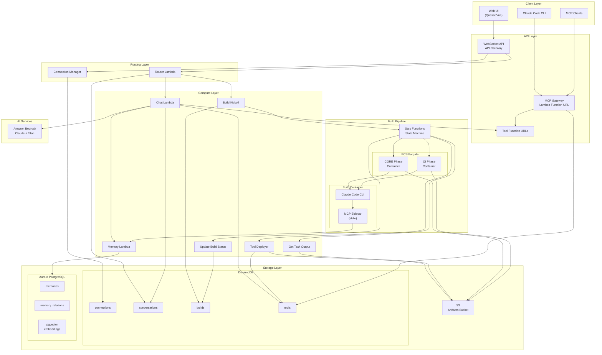
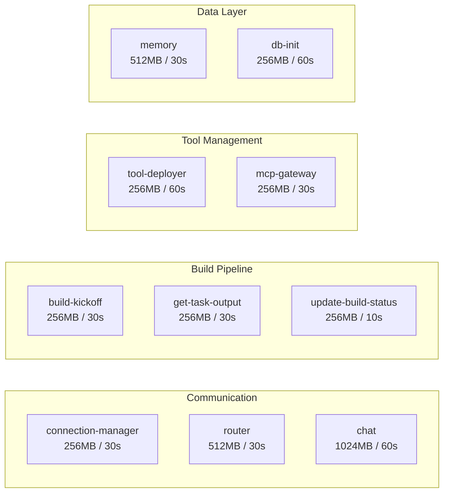
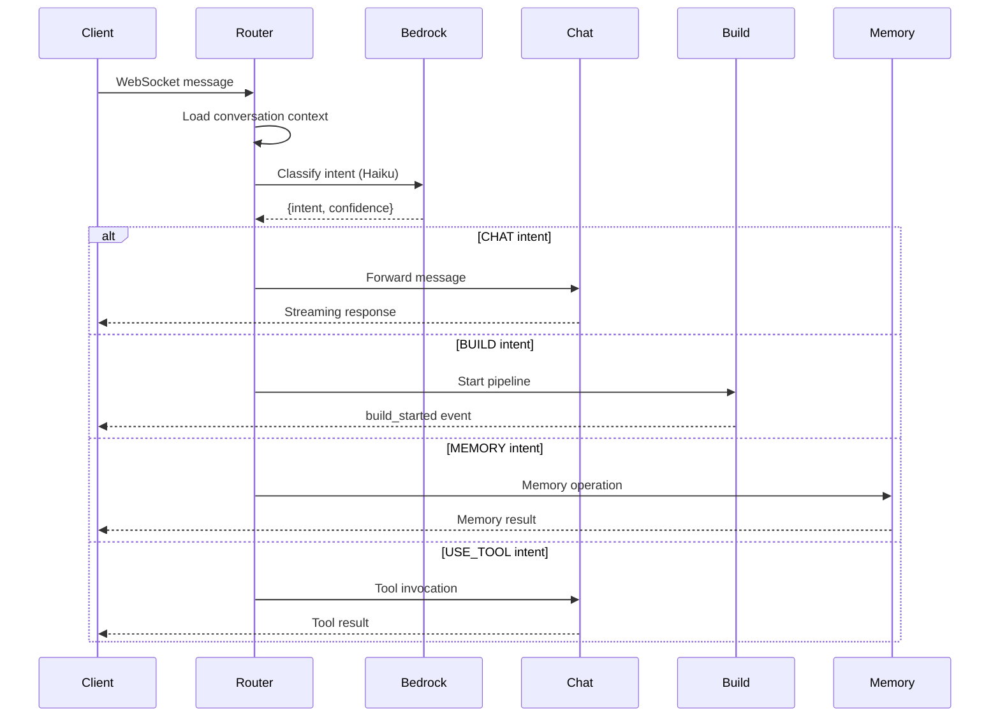
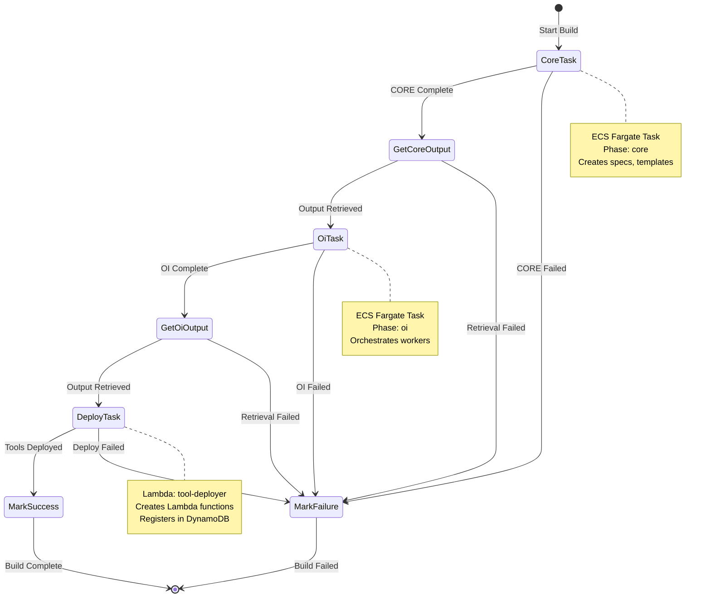
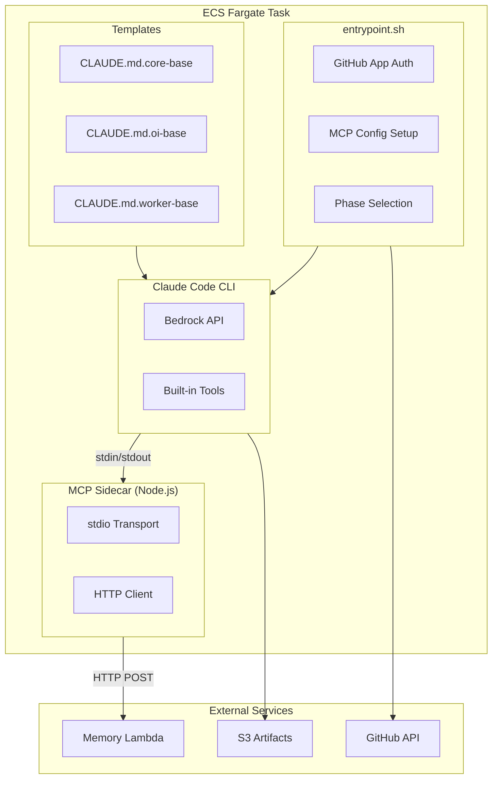
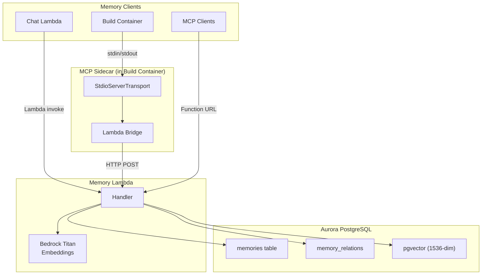
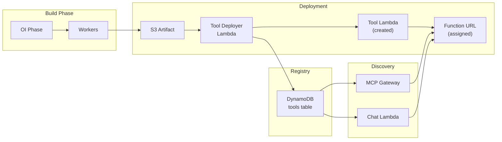
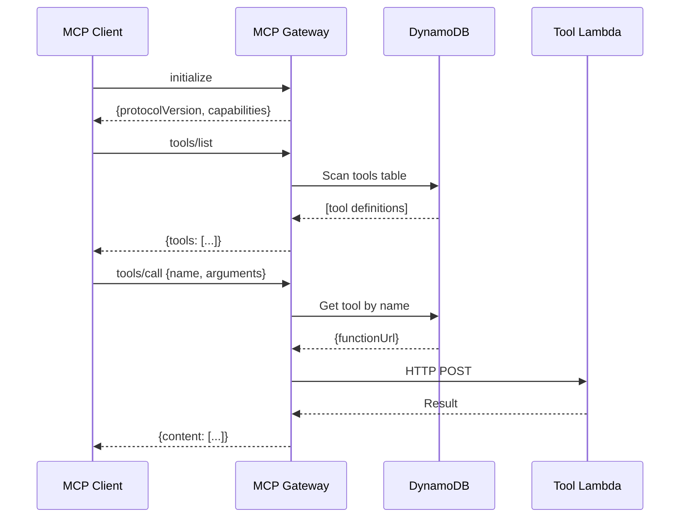
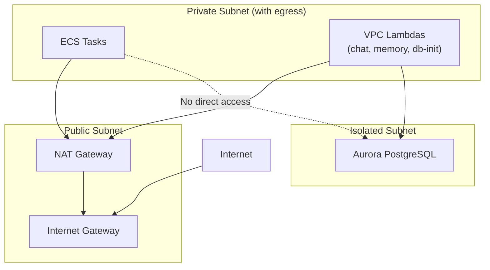

# FABLE Architecture Document

**Version:** 3.0 (Phase 4b - MCP Sidecar Complete)
**Last Updated:** 2026-02-06

FABLE (Forwardflow Autonomous Build Loop Engine) is a self-extending AI system where AI builds tools that AI can use.

---

## Table of Contents

1. [System Overview](#1-system-overview)
2. [High-Level Architecture](#2-high-level-architecture)
3. [Lambda Functions](#3-lambda-functions)
4. [Build Pipeline](#4-build-pipeline)
5. [Memory System](#5-memory-system)
6. [Tool System](#6-tool-system)
7. [Data Stores](#7-data-stores)
8. [Security Architecture](#8-security-architecture)
9. [Deployment](#9-deployment)
10. [Environment Configuration](#10-environment-configuration)

---

## 1. System Overview

### The Self-Extending Loop

```
User Request → FABLE Builds Tool → Tool Deployed → AI Can Use Tool → FABLE More Capable
```

This autonomous self-development loop is FABLE's unique value proposition. Users describe what they need in natural language, and FABLE:

1. **Decomposes** the request (CORE phase)
2. **Orchestrates** implementation (OI phase)
3. **Implements** via workers (Worker phase)
4. **Deploys** as Lambda functions
5. **Makes tools immediately available** via MCP Gateway

### Core Principles

| Principle | Implementation |
|-----------|----------------|
| **CLAUDE.md as Infrastructure** | Templates guide AI behavior, not programmatic control |
| **Trust the Machine Spirit** | Minimal guardrails, let Claude reason |
| **Template Inheritance** | CORE → OI → Worker templates cascade |
| **Observe Don't Rescue** | Let FABLE processes fail to learn |

---

## 2. High-Level Architecture

### System Architecture Diagram



### Component Summary

| Layer | Components | Purpose |
|-------|------------|---------|
| **Client** | Web UI, Claude Code CLI, MCP Clients | User interaction |
| **API** | WebSocket API, MCP Gateway, Tool URLs | Request routing |
| **Compute** | 10 Lambda functions | Business logic |
| **Build** | Step Functions + ECS Fargate | Build orchestration |
| **Storage** | DynamoDB, S3, Aurora | State and artifacts |
| **AI** | Amazon Bedrock | Claude and embeddings |

---

## 3. Lambda Functions

### Function Overview



### Detailed Function Reference

| Function | File | Purpose | VPC | Triggers |
|----------|------|---------|-----|----------|
| **connection-manager** | `lambda/connection-manager/` | WebSocket connect/disconnect | No | API GW $connect/$disconnect |
| **router** | `lambda/router/` | Intent classification, request routing | No | API GW $default |
| **chat** | `lambda/chat/` | Conversational AI with tool use | Yes | Lambda invoke |
| **build-kickoff** | `lambda/build-kickoff/` | Start build pipeline | No | Lambda invoke |
| **get-task-output** | `lambda/get-task-output/` | Retrieve phase outputs from S3 | No | Step Functions |
| **update-build-status** | `lambda/update-build-status/` | Update build completion | No | Step Functions |
| **tool-deployer** | `lambda/tool-deployer/` | Deploy tools as Lambdas | No | Step Functions |
| **mcp-gateway** | `lambda/mcp-gateway/` | MCP protocol endpoint | No | Function URL |
| **memory** | `lambda/memory/` | Memory CRUD + semantic search | Yes | Lambda invoke / Function URL |
| **db-init** | `lambda/db-init/` | Initialize Aurora schema | Yes | Manual / CDK |

### Intent Classification Flow



---

## 4. Build Pipeline

### Step Functions State Machine



### Build Container Architecture



### Phase Templates

| Template | Role | Responsibilities |
|----------|------|------------------|
| `CLAUDE.md.core-base` | Architect | Decomposition, spec creation, graph/timeline init |
| `CLAUDE.md.oi-base` | Orchestrator | Worker management, integration, verification |
| `CLAUDE.md.worker-base` | Implementer | Task implementation, testing, status reporting |

### Build Artifacts (S3)

```
builds/{buildId}/
├── core-output.json      # CORE phase result
├── oi-output.json        # OI phase result
├── requirements.md       # Specification document
├── graph.json            # Knowledge graph
├── timeline.jsonl        # Event timeline
└── tools/
    └── {tool-name}/
        ├── src/
        ├── package.json
        └── tool.json
```

---

## 5. Memory System

### Memory Architecture



### MCP Sidecar Configuration

The sidecar bridges Claude Code to the Memory Lambda via stdio transport:

```json
{
  "mcpServers": {
    "memory": {
      "command": "node",
      "args": ["/fable/mcp-sidecar/dist/index.js"],
      "env": {
        "MEMORY_LAMBDA_URL": "https://...",
        "FABLE_BUILD_ID": "...",
        "FABLE_ORG_ID": "..."
      }
    }
  }
}
```

### Memory Types and Behavior

| Type | Decays | Default Scope | Purpose |
|------|--------|---------------|---------|
| `insight` | No | project | Why decisions were made |
| `gotcha` | Yes | project | What went wrong, how to avoid |
| `preference` | No | private | How user likes things done |
| `pattern` | Yes | global | Successful approaches |
| `capability` | No | global | Tools/features built |
| `status` | Yes | project | Current state, where left off |

### Memory Tools

| Tool | Purpose |
|------|---------|
| `memory_create` | Store new memory with type/scope/importance |
| `memory_search` | Semantic + keyword search |
| `memory_session_start` | Load context at session start |
| `memory_boost` | Increase importance score |
| `memory_pin` | Prevent decay |
| `memory_relate` | Create knowledge graph edges |

### Database Schema

```sql
-- memories table
CREATE TABLE memories (
  id UUID PRIMARY KEY,
  type memory_type NOT NULL,           -- insight, gotcha, preference, pattern, capability, status
  content TEXT NOT NULL,
  embedding vector(1536),               -- pgvector
  scope memory_scope NOT NULL,          -- user, org, global
  source memory_source NOT NULL,        -- user_stated, ai_corrected, ai_inferred
  importance DECIMAL(3,2) DEFAULT 0.5,
  pinned BOOLEAN DEFAULT false,
  tags TEXT[],
  context JSONB,
  project VARCHAR(255),
  user_id UUID,
  org_id UUID,
  created_at TIMESTAMPTZ,
  updated_at TIMESTAMPTZ,
  accessed_at TIMESTAMPTZ,
  superseded_by UUID
);

-- memory_relations table
CREATE TABLE memory_relations (
  id UUID PRIMARY KEY,
  from_id UUID REFERENCES memories(id),
  to_id UUID REFERENCES memories(id),
  type VARCHAR(50),                     -- supersedes, relates_to, caused_by, fixed_by, implements
  created_at TIMESTAMPTZ
);

-- Semantic search function
CREATE FUNCTION search_memories(
  query_embedding vector(1536),
  user_id UUID,
  org_id UUID,
  scopes memory_scope[],
  limit_count INT
) RETURNS TABLE (...);
```

---

## 6. Tool System

### Tool Lifecycle



### MCP Gateway

The MCP Gateway provides a single endpoint for all FABLE-deployed tools:



### Tool Registration

Tools are stored in DynamoDB with:

```typescript
interface Tool {
  orgId: string;           // Partition key
  toolName: string;        // Sort key
  description: string;
  functionUrl: string;
  functionArn: string;
  inputSchema: object;
  outputSchema: object;
  buildId: string;
  gitRepo?: string;
  gitCommit?: string;
  createdAt: string;
  updatedAt: string;
}
```

---

## 7. Data Stores

### DynamoDB Tables

```mermaid
erDiagram
    CONNECTIONS {
        string connectionId PK
        string userId
        string orgId
        string connectedAt
        number ttl
    }

    CONVERSATIONS {
        string userId PK
        string conversationId SK
        string orgId
        array messages
        string activeBuildId
        string createdAt
    }

    BUILDS {
        string orgId PK
        string buildId SK
        string userId
        string request
        string status
        string phase
        number progress
        string error
        string createdAt
    }

    TOOLS {
        string orgId PK
        string toolName SK
        string description
        string functionUrl
        string functionArn
        object inputSchema
        string buildId
        string createdAt
    }
```

### S3 Bucket Structure

```
fable-artifacts-{stage}-{account}/
├── builds/
│   └── {buildId}/
│       ├── core-output.json
│       ├── oi-output.json
│       ├── requirements.md
│       ├── graph.json
│       ├── timeline.jsonl
│       └── tools/
│           └── {tool-name}/
│               ├── src/index.ts
│               ├── package.json
│               └── tool.json
└── logs/
    └── {buildId}/
        └── {phase}-{timestamp}.log
```

### Aurora PostgreSQL

- **Engine:** PostgreSQL 16.4 with pgvector extension
- **Type:** Aurora Serverless v2
- **Scaling:** 0.5-4 ACU (dev), 0.5-16 ACU (prod)
- **Tables:** memories, memory_relations
- **Vector Index:** IVFFlat with 100 lists

---

## 8. Security Architecture

### Network Isolation



### IAM Roles

| Role | Permissions |
|------|-------------|
| **Chat Lambda** | DynamoDB (connections, conversations, tools), Bedrock invoke, Memory Lambda invoke |
| **Tool Deployer** | Lambda management (fable-*-tool-*), IAM PassRole, DynamoDB tools, S3 artifacts |
| **Build Task** | Bedrock invoke, S3 read-write, DynamoDB read-write, Secrets Manager read |
| **Tool Execution** | S3 read (artifacts), Memory Lambda invoke, CloudWatch Logs |

### Secrets Management

| Secret | Storage | Consumer |
|--------|---------|----------|
| Aurora credentials | Secrets Manager | Memory Lambda, DB Init |
| GitHub App credentials | Secrets Manager | Build entrypoint |
| API keys | Environment variables | Lambda functions |

---

## 9. Deployment

### Infrastructure Deployment

```bash
# Deploy CDK stack
cd packages/infra
npm run build
npx cdk deploy --require-approval never
```

### Build Container Deployment

```bash
# Build and push Docker image
docker buildx build \
  --platform linux/amd64 \
  -t 767398133785.dkr.ecr.us-west-2.amazonaws.com/fable-dev-build:latest \
  -f packages/infra/build/Dockerfile . \
  --push
```

### Tool Deployment via GitHub Actions

Tools can be deployed from FABLE-TOOLS repository:

1. Push to feature branch
2. GitHub Action triggers on push
3. Assumes AWS role via OIDC
4. Calls Tool Deployer Lambda
5. Lambda registered in DynamoDB

---

## 10. Environment Configuration

### Development (fable-dev)

| Setting | Value |
|---------|-------|
| Aurora ACU | 0.5 - 4 |
| NAT Gateways | 1 |
| Deletion Protection | No |
| Log Retention | 14 days |

### Production (fable-prod)

| Setting | Value |
|---------|-------|
| Aurora ACU | 0.5 - 16 |
| NAT Gateways | 2 |
| Deletion Protection | Yes |
| Log Retention | 90 days |

### Key Environment Variables

| Variable | Used By | Purpose |
|----------|---------|---------|
| `STAGE` | All Lambdas | Environment identifier |
| `CONNECTIONS_TABLE` | Router, Chat, ConnMgr | WebSocket connections |
| `CONVERSATIONS_TABLE` | Router, Chat | Message history |
| `BUILDS_TABLE` | Build Kickoff, Update Status | Build tracking |
| `TOOLS_TABLE` | Chat, Tool Deployer, MCP Gateway | Tool registry |
| `ARTIFACTS_BUCKET` | Tool Deployer, Get Output | S3 bucket name |
| `AURORA_SECRET_ARN` | Memory, DB Init | Database credentials |
| `MEMORY_LAMBDA_URL` | Build Container | Memory Lambda endpoint |
| `STATE_MACHINE_ARN` | Build Kickoff | Step Functions ARN |

---

## Appendix: File Structure

```
FABLE/
├── docs/
│   ├── ARCHITECTURE.md              # This document
│   └── diagrams/
│       └── fable-architecture.excalidraw
├── iteration-2/
│   └── templates/                   # Build phase templates
│       ├── CLAUDE.md.core-base
│       ├── CLAUDE.md.oi-base
│       └── CLAUDE.md.worker-base
├── packages/
│   ├── infra/
│   │   ├── lib/
│   │   │   └── fable-stack.ts       # CDK stack (972 lines)
│   │   ├── lambda/
│   │   │   ├── build-kickoff/
│   │   │   ├── chat/
│   │   │   ├── connection-manager/
│   │   │   ├── db-init/
│   │   │   ├── get-task-output/
│   │   │   ├── mcp-gateway/
│   │   │   ├── memory/
│   │   │   ├── router/
│   │   │   ├── tool-deployer/
│   │   │   └── update-build-status/
│   │   ├── build/
│   │   │   ├── Dockerfile
│   │   │   └── entrypoint.sh
│   │   └── mcp-sidecar/
│   │       ├── src/index.ts
│   │       ├── package.json
│   │       └── tsconfig.json
│   ├── mcp-servers/
│   │   └── memory/                  # Standalone MCP server
│   └── shared/
│       └── src/types.ts
├── CLAUDE.md                        # Project instructions
├── CURRENT-WORK.md                  # Active work tracking
└── brainstorm.md                    # Full product vision
```

---

## Revision History

| Version | Date | Changes |
|---------|------|---------|
| 1.0 | 2026-01-15 | Initial architecture |
| 2.0 | 2026-01-28 | Added Memory Lambda, Aurora, scalable design |
| 3.0 | 2026-02-06 | Phase 4b: MCP stdio sidecar, updated diagrams |
